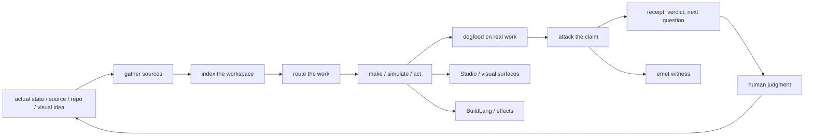

# Zain Dana Harper / Project Telos

<!-- markdownlint-disable MD013 MD026 MD033 -->


> **Build with a model. Take nothing on faith.**

I build engines that do heavy, interesting work: map a whole workspace into a
navigable atlas in seconds, capture research from places scrapers give up on,
run agent fleets you can replay step by step, compile a typed-effects language
to native code, and render generative art from real mathematics. **Project
Telos** is the line that holds them together: eight flagships, all runnable,
published, and tested. Every claim below links to the thing that proves it.

**Site:** [harperz9.github.io](https://harperz9.github.io) · **Work:**
[resume](https://harperz9.github.io/resume.html) ·
[portfolio](https://harperz9.github.io/portfolio.html) ·
[CV](https://harperz9.github.io/cv.html) ·
[research](https://harperz9.github.io/research.html) ·
[Studio](https://harperz9.github.io/studio.html) ·
[the person behind it](https://harperz9.github.io/person.html)

Seattle, WA · Rust · Python · C++23 · [ORCID 0009-0001-7175-5393](https://orcid.org/0009-0001-7175-5393) · open to research or engineering work.

## The flagships

Versions, CI status, and downloads below pull straight from each registry and
GitHub on page load, no hand-typed numbers to rot.

[](https://pypi.org/project/index-graph/) [](https://pypi.org/project/gather-engine/) [](https://pypi.org/project/forum-engine/) [](https://pypi.org/project/crucible-bench/) [](https://pypi.org/project/emet/) [](https://crates.io/crates/buildlang/)

[](https://github.com/HarperZ9/index/actions/workflows/ci.yml) [](https://github.com/HarperZ9/gather/actions/workflows/ci.yml) [](https://github.com/HarperZ9/forum/actions/workflows/ci.yml) [](https://github.com/HarperZ9/crucible/actions/workflows/ci.yml) [](https://github.com/HarperZ9/emet/actions/workflows/conformance.yml) [](https://github.com/HarperZ9/buildlang/actions/workflows/ci.yml)

[](https://pypi.org/project/index-graph/) [](https://pypi.org/project/gather-engine/) [](https://pypi.org/project/forum-engine/) [](https://pypi.org/project/crucible-bench/) [](https://pypi.org/project/emet/) [](https://crates.io/crates/buildlang/)

| Tool | What it does | Install | The receipt that matters |
| --- | --- | --- | --- |
| [telos](https://github.com/HarperZ9/telos) | The workbench: shared human/model workspace, MCP tools, Studio surfaces, and a `telos proof` CLI that turns agent actions, research, builds, and visuals into re-checkable packets (`MATCH`/`DRIFT`/`UNVERIFIABLE`). | `node demo/run.mjs` | `0.2.0`, frontier R&D substrate, honestly early |
| [index](https://github.com/HarperZ9/index) | Map one repo into a verified wiki, or a whole workspace into a two-layer code+docs atlas. Built from file:line evidence. | `pip install index-graph` | deterministic, byte-identical output · known-bad fixtures kept as failing tests |
| [gather](https://github.com/HarperZ9/gather) | Capture web, video, papers, PDFs, browser/OCR/audio into verified research packets. | `pip install gather-engine` | provenance receipt on every item · witnessed digest seal catches tampering |
| [forum](https://github.com/HarperZ9/forum) | Coordinate agent fleets through a tamper-evident, replayable ledger. Model-agnostic. | `pip install forum-engine` | hash-chain + content-addressed bodies · Merkle checkpoint avoids CVE-2012-2459 |
| [crucible](https://github.com/HarperZ9/crucible) | Check a thesis against the measurement that could break it. Steelman, measure, verdict. | `pip install crucible-bench` | verdict is a pure function of the recorded measurement, no model in the loop |
| [emet](https://github.com/HarperZ9/emet) | A small external witness: re-derive the bytes, get `MATCH`/`DRIFT`/`UNVERIFIABLE`. Never `TRUSTED`. | `pip install emet` | **frozen spec** · 4 implementations (Py/Rust/Node/Go) pass **35 conformance vectors** in CI · MPL-2.0 |
| [buildlang](https://github.com/HarperZ9/buildlang) | A Rust typed-effects compiler: functions declare what they may touch, the compiler checks the promise. C verified backend, HLSL/GLSL out. | `cargo install buildlang` | **940+ tests passing (0 failing)** · typed effects · C verified backend |
| [learn](https://github.com/HarperZ9/learn) | Accountable credential + coursework engine. Halts hard at every graded step; FSRS spaced repetition. | `node src/cli.mjs` | `1.6.0` · **240 tests** · `mastery()` is a pure function of your own practice, never the machine's |

Every engine returns `MATCH`, `DRIFT`, or `UNVERIFIABLE`, never a fourth word.
Pick the claim that sounds too confident and try to break it.

## How the engines fit together



The accountability line runs through all of them: a claim stands beside its
source, a model answer can say `UNVERIFIABLE`, an idea leaves a receipt.

## Run one in five minutes

These are not profile decorations; they are small doors into the workbench.

```bash
# map a workspace into one HTML file
pip install index-graph
index atlas --root /path/to/workspace --format html --out atlas.html

# replay an agent route, then watch the ledger catch a tampered result
git clone https://github.com/HarperZ9/forum && cd forum
python examples/demo.py

# force a verdict: does a confident claim survive the measurement?
git clone https://github.com/HarperZ9/crucible && cd crucible
python examples/demo.py

# four languages, one frozen spec, 35 conformance vectors
git clone https://github.com/HarperZ9/emet && cd emet
python conformance/run.py membrane.py
```

More surfaces: [Studio](https://harperz9.github.io/studio.html) (visual),
[catalog](https://harperz9.github.io/catalog.html) (atlas),
[flagships overview](https://harperz9.github.io/overview.html),
[research lanes](https://harperz9.github.io/research.html).

## How I actually work

<details>
<summary><strong>The loop.</strong></summary>

Scan the real project. Read the old sessions. Find the current state. Pull the
docs, repos, tests, demos, and market evidence into the same room. Build the
smallest tool that changes the situation. Use it immediately. Let it fail in
public or near-public conditions. Fold the failure back into the product.
Commit, push, verify, repeat.

That loop is the personality. I get impatient when work becomes posture, when
tools are protected from real use, or when a claim cannot be made to stand next
to its source. I am more interested in the moment where the thing breaks and
becomes better than the moment where it first sounds impressive.

</details>

<details>
<summary><strong>Why accountability.</strong></summary>

I do not write about accountability because I think I am naturally accountable.
I write about it because I know how easy it is to dodge the mirror: blame the
room, overclaim the work, take shortcuts, want credit before earning it, or
confuse intensity with progress.

The tools are built against that. They make a claim stand beside its source.
They make a model answer say `UNVERIFIABLE`. They make an idea leave a receipt.
They give the next attempt somewhere firmer to launch from than mood, memory,
or self-protection. The personal version of this is on
[person.html](https://harperz9.github.io/person.html).

</details>

<details>
<summary><strong>The pressure I put on tools.</strong></summary>

- **Dogfood it:** if the tool is for developers, run it on real repositories.
- **Adversarially test it:** make the smallest failure case and keep it.
- **Make it public when it can be:** ship the repo, demo, issue, receipt, or page.
- **Keep the art alive:** rigor can still have color, rhythm, naming, and motion.
- **Do not sand off the ambition:** narrow the next step without pretending the larger project stopped mattering.

</details>

## The throughline, in plain English

I came up without a CS degree or industry certification. The credential is the
public trail: shipped crates, a published VS Code extension,
[Elder ENB](https://www.nexusmods.com/skyrimspecialedition/mods/117327) (a
Skyrim graphics project past 900,000 downloads), open repositories, and tools
that can be cloned, run, and argued with.

<details>
<summary><strong>The work that shaped me.</strong></summary>

- **Technical Networking Support, Xbox Division:** TCP/IP, DNS, NAT, router configuration. The first hard lesson that a correct answer is not useful until another person can act on it.
- **Operations Manager / Lead Arborist, family business:** field work, client relations, scheduling, proposals, budgets, safety procedures. Accountability that is not abstract.
- **Freelance technical writing and consulting:** API guides, security and compliance documentation, onboarding material. Explaining systems without exposing client internals.
- **Independent engineering since 2023:** compilers, graphics, color science, multi-agent systems, research tooling, public demos under Project Telos.

</details>

<details>
<summary><strong>The projects that changed the shape of the work.</strong></summary>

- **Elder ENB:** two years of public releases, named editions, 900k+ downloads. Taught taste, iteration, users, and the difference between a pretty frame and a maintained system.
- **Native graphics lineage:** D3D11/HLSL renderers, proxy-DLL interception, mid-frame compute dispatch, ACES/AgX tone mapping, TAA, SSR, SSGI, GTAO, volumetrics, ImGui tools, CMake/vcpkg, shared-memory IPC.
- **Build Color:** a color-science workbench. Color spaces, HDR tone mapping, perceptual difference metrics, chromatic adaptation, ICC profiles, gamut work, color-vision simulation, 3D LUTs.
- **BuildLang:** a typed-effects language and compiler line. Lexing, parsing, checking, effects, lifetimes, C FFI, C lowering, editor support, explicit maturity labels for unfinished parts.
- **Project Telos:** the current flagship. Durable state, senses, action boundaries, receipts, and checks before anyone is asked to trust it.

</details>

## Open traps

Project Telos needs people willing to use the engines against real workflows,
break the receipt discipline, and report where the proof surface fails.

- [Test gather intake](https://github.com/HarperZ9/gather/issues/1)
- [Test index maps](https://github.com/HarperZ9/index/issues/13)
- [Test forum ledgers](https://github.com/HarperZ9/forum/issues/1)
- [Test crucible checks](https://github.com/HarperZ9/crucible/issues/1)
- [Test the telos surface](https://github.com/HarperZ9/telos/issues/2)
- **emet's highest-leverage ask:** a *different-author* implementation from [SPEC.md](https://github.com/HarperZ9/emet/blob/main/SPEC.md) alone, in any language, passing `conformance/vectors.json`. That converts re-derivability from *asserted* to *demonstrated*.

## How this profile is built

This README is part of the workbench. It has a local verifier and CI, and stays
deliberately static: no badge wall beyond what each tool actually earns, no
visitor counter, no dashboard that silently rots. The banner is generated art:
a seeded flow field in the Project Telos spectrum, the same family the site
draws live in your browser.

```powershell
git status --short
python scripts/check_profile_surface.py
```

- [enterprise profile receipt](docs/research/2026-07-01-enterprise-profile-research.md)
- [profile template research](docs/research/2026-07-01-profile-template-research.md)
- [index scope assessment](docs/research/2026-07-01-index-scope-assessment.md)

Build it to be checked, or do not ship it.
