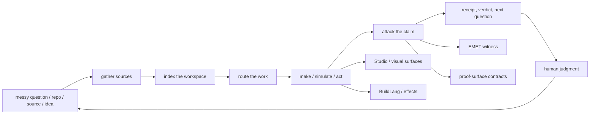
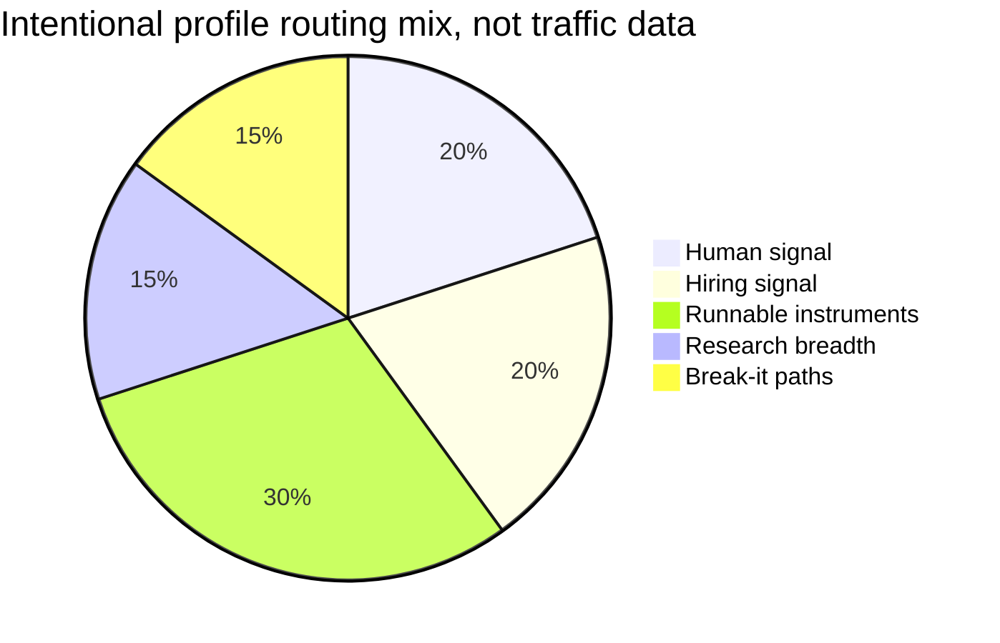

# Zain Dana Harper / Project Telos

<!-- markdownlint-disable MD013 MD026 MD033 -->


> Build with a model. Take nothing on faith.

This is a workbench, not a trophy case.

I am **Zain Dana Harper**, a self-taught systems engineer in Seattle. I build
**Project Telos** as a cross-domain **research lab and product ecosystem** for
AI-era work: source intake, workspace maps, agent ledgers, claim checks,
compiler experiments, graphics, color, simulation, learning workflows, and the
receipts that make the whole thing inspectable.

The clean surface is a little misleading. The person at the bench is artistic,
restless, fallible, stubborn, and very capable of sprinting after a beautiful
wrong idea. I build verification systems because I need them. I make strange
connections, take wrong turns, argue with the machine, get humbled by tests,
and keep the parts that survive being checked.

If you are hiring, the useful signal is not that I can use AI. It is that I can
turn ambiguous technical work into instruments another engineer can run, read,
break, and improve.

**Site:** [harperz9.github.io](https://harperz9.github.io)

**Work:** [resume](https://harperz9.github.io/resume.html) | [portfolio](https://harperz9.github.io/portfolio.html) | [CV](https://harperz9.github.io/cv.html) | [research](https://harperz9.github.io/research.html) | [Studio](https://harperz9.github.io/studio.html)

**Flagships:** [telos](https://github.com/HarperZ9/telos) | [index](https://github.com/HarperZ9/index) | [gather](https://github.com/HarperZ9/gather) | [forum](https://github.com/HarperZ9/forum) | [crucible](https://github.com/HarperZ9/crucible) | [emet](https://github.com/HarperZ9/emet) | [buildlang](https://github.com/HarperZ9/buildlang) | [learn](https://github.com/HarperZ9/learn)

## Choose a door.

<details open>
<summary><strong>I have 30 seconds.</strong></summary>

Open the [portfolio](https://harperz9.github.io/portfolio.html), then skim the
instrument table below. The pattern to look for: one builder turning AI work,
research, codebases, and creative systems into artifacts with receipts,
boundaries, and runnable surfaces.

</details>

<details>
<summary><strong>I am hiring for AI tooling or platform work.</strong></summary>

Start with [telos](https://github.com/HarperZ9/telos),
[index](https://github.com/HarperZ9/index), and
[gather](https://github.com/HarperZ9/gather). I am strongest where the problem
is underspecified: agent workflows, research infrastructure, developer tools,
source-grounded systems, and products that need both taste and discipline.

</details>

<details>
<summary><strong>I am an engineer and want proof.</strong></summary>

Run this profile verifier, then inspect one flagship end to end:

```powershell
git clone https://github.com/HarperZ9/HarperZ9
cd HarperZ9
python scripts/check_profile_surface.py
```

Good first checks: run an `index` map, capture a `gather` packet, replay a
`forum` ledger, force a `crucible` verdict, or inspect `buildlang` backend
maturity labels.

</details>

<details>
<summary><strong>I want the weird human part.</strong></summary>

I like systems that feel alive: visual tools, hard edges, careful names,
generative art, color science, old graphics pipelines, compiler guts, and the
moment when a messy private sketch becomes something another person can touch.
I also overreach. I revise. I need public boundaries because ambition without a
record turns into theater.

</details>

<details>
<summary><strong>I want to break it.</strong></summary>

Pick the claim that sounds too confident. Stale a map. Tamper with a receipt.
Force a model answer past its source. Make a demo return `UNVERIFIABLE` for the
right reason. The best feedback is the smallest reproducible case where the
proof surface fails.

</details>

## The instruments.

| If you want to... | Open | What it proves first |
| --- | --- | --- |
| Make AI work inspectable | [telos](https://github.com/HarperZ9/telos) | Shared human/model workspace, MCP tools, Studio surfaces, browser evidence, and replayable receipts. |
| See a codebase as a map | [index](https://github.com/HarperZ9/index) | Workspace atlas, dependency evidence, freshness checks, and context envelopes. |
| Bring messy sources inside | [gather](https://github.com/HarperZ9/gather) | Method-labeled intake for web, docs, feeds, papers, PDFs, browser/OCR/audio paths, APIs, and derived notes. |
| Route agent work without losing the trail | [forum](https://github.com/HarperZ9/forum) | Ledgers, budgets, route records, resume state, intent checks, and verifier seams. |
| Attack a claim | [crucible](https://github.com/HarperZ9/crucible) | `MATCH`, `DRIFT`, or `UNVERIFIABLE`, with the boundary visible. |
| Witness bytes from outside the claim | [emet](https://github.com/HarperZ9/emet) | Source/view consistency across independent conformance vectors. |
| Work below the app layer | [buildlang](https://github.com/HarperZ9/buildlang) | Rust compiler, typed effects, C as verified path, shader backends, and LSP surface. |
| Learn without bypassing the human | [learn](https://github.com/HarperZ9/learn) | Credential and coursework workflows that halt at graded steps and witness boundaries. |

## The map.

GitHub renders this as a static diagram. The live surfaces are on the site:
[catalog](https://harperz9.github.io/catalog.html),
[flagships](https://harperz9.github.io/overview.html),
[studio](https://harperz9.github.io/studio.html), and
[research](https://harperz9.github.io/research.html).





## What I am unusually good at.

- Entering ambiguous technical systems and finding the moving parts.
- Turning repeated workflows into CLIs, checks, docs, package surfaces, and
  public handoff contracts.
- Keeping AI useful without treating model output as authority.
- Working across Python, Rust, JavaScript, C++, graphics/native systems,
  compiler ideas, docs, and product surfaces.
- Caring about the feel of the thing: names, diagrams, colors, error states,
  alt text, scan paths, and whether the tool invites a person to keep thinking.

## What I am not pretending.

- A broad research lab is not the same thing as finished expertise in every
  domain. Some lanes are mature tools; some are proof packets; some are
  experiments with explicit gaps.
- A receipt is not truth. It is a way to preserve enough state that another
  person can check what happened.
- A model is not a coworker, a judge, or a source of authority. It is a powerful
  instrument that needs memory, senses, brakes, and a record.
- I am not polished all the way down. I am a human trying to build clean
  instruments from a messy interior life.

## Domain lanes.

The accountability line is the method, not the whole body of work.

- **AI accountability:** provenance receipts, claim checks, MCP surfaces, agent
  routing, model-boundary discipline, and public verification paths.
- **Research operations:** source capture, domain packets, adversarial testing,
  negative fixtures, and docs that mark what is verified, experimental, or
  unproven.
- **Systems and compilers:** Python tooling, Rust and C++ systems work,
  compiler/runtime experiments, typed effects, codegen, and release gates.
- **Graphics and color:** D3D11, HLSL, GPU traces, display calibration, ICC, 3D
  LUTs, perceptual color, Oklab, CAT16, and color-vision simulation.
- **Formal and physical systems:** theorem replay, physics/PDEs, thermodynamic
  computing, quantum workflows, numerical invariants, and AI4Science packets.
- **Public product shipping:** Project Telos on GitHub, Elder ENB on
  [NexusMods](https://www.nexusmods.com/skyrimspecialedition/mods/117327), and
  a site where public pages link back to source.

## Open traps.

Project Telos needs people willing to use the engines against real workflows,
break the receipt discipline, and report where the proof surface fails.

- [Test gather intake](https://github.com/HarperZ9/gather/issues/1)
- [Test index maps](https://github.com/HarperZ9/index/issues/13)
- [Test forum ledgers](https://github.com/HarperZ9/forum/issues/1)
- [Test crucible checks](https://github.com/HarperZ9/crucible/issues/1)
- [Test the telos surface](https://github.com/HarperZ9/telos/issues/2)

## How this profile is built.

This README is part of the workbench. It has a local verifier, CI, a template
research receipt, an index-backed scope assessment, and a market/telemetry
receipt. It stays deliberately static: no badge wall, no visitor counter, no
typing SVG, and no dashboard that silently rots.

- [enterprise profile receipt](docs/research/2026-07-01-enterprise-profile-research.md)
- [profile template research](docs/research/2026-07-01-profile-template-research.md)
- [index scope assessment](docs/research/2026-07-01-index-scope-assessment.md)

```powershell
git status --short
python scripts/check_profile_surface.py
```

Build it to be checked, or do not ship it.
