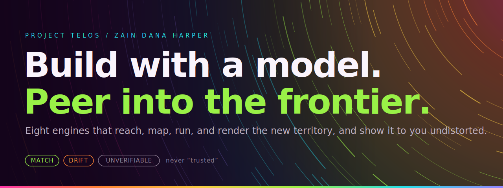
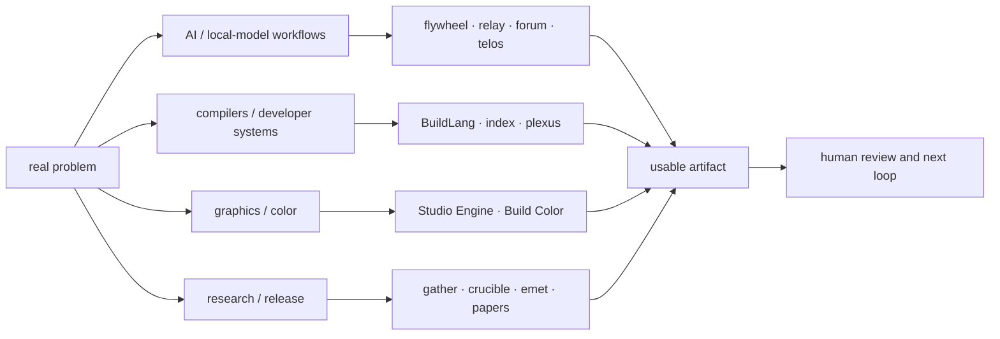

# Zain Dana Harper / Project Telos

<!-- markdownlint-disable MD013 MD026 MD033 -->



> **Systems engineer and technical artist. One workshop, many routes.**

I build across **AI and local-model infrastructure, agent tooling, compilers,
graphics and color, and research and release systems**. **Project Telos** is
the public workshop that holds those lanes together. The shared habit is
simple: map the system, make the surface, test the claim, and leave a usable
artifact.

The banner names the ambition, not a blanket maturity claim. Some tools can
run anywhere with few or no dependencies; others are Windows-native, GPU-facing,
pre-1.0, or research-only. Some are released packages, some are public beta,
and some are active R&D. Each project carries its own status below.

**Start here:** [Project Telos](https://harperz9.github.io/) ·
[Portfolio](https://harperz9.github.io/portfolio.html) ·
[Resume](https://harperz9.github.io/resume.html) ·
[CV](https://harperz9.github.io/cv.html) ·
[LinkedIn](https://www.linkedin.com/in/zaindanaharper/)

**Explore:** [research](https://harperz9.github.io/research.html) ·
[papers](https://harperz9.github.io/publications.html) ·
[Studio](https://harperz9.github.io/studio.html) ·
[the person behind it](https://harperz9.github.io/person.html)

Seattle, WA · Rust · Python · C++23 ·
[ORCID 0009-0001-7175-5393](https://orcid.org/0009-0001-7175-5393) ·
open to paid engineering, applied R&D, developer-tooling, and technical-art work.

## Choose a door

| Lane | Start with | Current shape |
| --- | --- | --- |
| AI and local-model infrastructure | [flywheel](https://github.com/HarperZ9/flywheel), [relay](https://github.com/HarperZ9/relay) | Harness, endpoint, routing, failover, and evaluation work. Active R&D plus a 0.1.0 source prototype; benchmark conclusions stay scoped to the task set that produced them. |
| Agent tooling | [telos](https://github.com/HarperZ9/telos), [index](https://github.com/HarperZ9/index), [gather](https://github.com/HarperZ9/gather), [forum](https://github.com/HarperZ9/forum), [crucible](https://github.com/HarperZ9/crucible) | A mixed-maturity toolchain for context, research intake, orchestration, evaluation, and human/model workspaces. |
| Compilers and developer systems | [BuildLang](https://github.com/HarperZ9/buildlang) | Rust-built typed-effects compiler. The C execution path and HLSL/GLSL output are the current core; other backends and linear types remain explicitly experimental. |
| Graphics and generated media | [Studio Engine](https://github.com/HarperZ9/studio-engine), [Elder ENB](https://www.nexusmods.com/skyrimspecialedition/mods/117327) | A pre-1.0 generative engine beside an established public graphics project shaped by years of releases and user feedback. |
| Color and calibration | [Build Color](https://github.com/HarperZ9/build-color) | A 1.0.2 beta color-science workbench for spaces, HDR tone mapping, appearance models, difference metrics, ICC, and LUT workflows. |
| Research and release tooling | [papers](https://harperz9.github.io/publications.html), [release toolkit](https://harperz9.github.io/toolkit.html), [emet](https://github.com/HarperZ9/emet) | Public papers, source/provenance workflows, package and CI checks, release surfaces, and a byte-level integrity witness. |

## The flagships

The badges pull versions, CI state, and downloads from registries and GitHub on
page load. Static maturity wording below follows the 2026-07-12 career-facts
authority; it is labeled by project rather than promoted into one ecosystem
claim.

[](https://pypi.org/project/index-graph/) [](https://pypi.org/project/gather-engine/) [](https://pypi.org/project/forum-engine/) [](https://pypi.org/project/crucible-bench/) [](https://pypi.org/project/emet/) [](https://crates.io/crates/buildlang/)

[](https://github.com/HarperZ9/index/actions/workflows/ci.yml) [](https://github.com/HarperZ9/gather/actions/workflows/ci.yml) [](https://github.com/HarperZ9/forum/actions/workflows/ci.yml) [](https://github.com/HarperZ9/crucible/actions/workflows/ci.yml) [](https://github.com/HarperZ9/emet/actions/workflows/conformance.yml) [](https://github.com/HarperZ9/buildlang/actions/workflows/ci.yml)

[](https://pypi.org/project/index-graph/) [](https://pypi.org/project/gather-engine/) [](https://pypi.org/project/forum-engine/) [](https://pypi.org/project/crucible-bench/) [](https://pypi.org/project/emet/) [](https://crates.io/crates/buildlang/)

| Tool | What it does | Maturity | The receipt that matters |
| --- | --- | --- | --- |
| [flywheel](https://github.com/HarperZ9/flywheel) | Runs local and hosted model routes through the same harness and oracle-backed evaluation paths. | **Research · active R&D.** No portfolio-wide model-superiority claim; each result belongs to its recorded task set, endpoint, and budget. | Cross-harness manifests, endpoint receipts, raw benchmark artifacts, and explicit non-conclusions. |
| [telos](https://github.com/HarperZ9/telos) | Shared human/model workbench, MCP surfaces, creative tools, and four proof lanes through one CLI. | **Public work · 0.2.0 pre-1.0 source-registry package.** Tested surface; interfaces may move and npm publishing is operator-gated. | Re-checkable agent, research, visual, and build packets with explicit non-claims. |
| [index](https://github.com/HarperZ9/index) | Maps a repo or workspace into an atlas, context envelope, symbol graph, or verified wiki. | **Public work · 2.9.0 beta.** Zero runtime dependencies. | File-and-line evidence, typed omission receipts, and freshness checks. |
| [gather](https://github.com/HarperZ9/gather) | Captures web, video, papers, PDFs, browser/OCR/audio, and structured sources into research packets. | **Public work · 1.6.1 release.** | Provenance and digest verification stay attached to each captured item. |
| [forum](https://github.com/HarperZ9/forum) | Routes multi-agent work through replayable ledgers, context budgets, gates, and campaigns. | **Public work · 1.13.0 versioned public package.** | Hash-chained bodies and records of who did what, under which route and constraint. |
| [crucible](https://github.com/HarperZ9/crucible) | Registers a thesis, steelmans it, measures it, and emits a bounded verdict. | **Public work · 1.2.0 versioned public package.** | The verdict is recomputed from the recorded measurement rather than accepted from prose. |
| [emet](https://github.com/HarperZ9/emet) | Re-derives byte-level integrity facts without making trust or release decisions. | **Public work · 1.0.0 on default public main and the local release tag; frozen 1.0.0 spec.** Four same-author implementations share the core; receipt and rebind coverage is capability-specific. | A different-author implementation is still the open bar for demonstrated independent re-derivability. |
| [buildlang](https://github.com/HarperZ9/buildlang) | Compiles typed-effects source through C and emits HLSL/GLSL shader source. | **Public work · 1.2.0 source manifest.** C, effects, HLSL/GLSL, and receipts are core; SPIR-V, LLVM, WASM, Rust, native-ISA backends, GPU dispatch, and linear types are experimental. | Backend maturity is stated per target instead of hidden behind one compiler-wide label. |
| [learn](https://github.com/HarperZ9/learn) | Turns source material into coursework, retrieval practice, spaced repetition, and graded records. | **Public work · 1.6.0 source version.** Zero runtime dependencies. | `mastery()` is derived from the learner's recorded practice. |

### Working surfaces beyond the flagship table

| Project | Current role | Maturity |
| --- | --- | --- |
| [relay](https://github.com/HarperZ9/relay) | Coding-agent and endpoint ladder for local servers, authenticated CLIs, and configured APIs. | **Public work · 0.1.0 source prototype.** Git install; scopes writes and execution behind explicit flags. |
| [plexus](https://github.com/HarperZ9/plexus) | Discovers what agent tools emit and consume, then proposes inspectable capability routes. | **Public work · 0.1.0 source prototype.** Git install; unmatched inputs and cycles remain visible. |
| [mneme](https://github.com/HarperZ9/mneme) | Local agent memory with provenance, reproducible ranking, and drift checks. | **Public work · 0.1.0 source prototype.** Git install; PyPI release is not claimed yet. |
| [studio-engine](https://github.com/HarperZ9/studio-engine) | Generates replayable shader, audio, motion, and raster artifacts from a seed. | **Research · 0.2.0 pre-1.0 engine.** APIs may move. |
| [build-color](https://github.com/HarperZ9/build-color) | Color spaces, HDR tone mapping, appearance models, difference metrics, ICC, and LUT workflows. | **Public work · 1.0.2 beta.** A workbench and toolkit, not a physical measurement instrument. |

## How the workshop fits together



The projects connect where their interfaces are real. They do not need to share
one verdict vocabulary, deployment target, license, or maturity stage to belong
to the same workshop. Rigor is the floor; it is not the only room.

## Run one in five minutes

These are not profile decorations; they are small doors into the workbench.

```bash
# map a workspace into one HTML file
pip install index-graph
index atlas --root /path/to/workspace --format html --out atlas.html

# replay an agent route, then watch the ledger catch a tampered result
git clone https://github.com/HarperZ9/forum && cd forum
python examples/demo.py

# force a verdict: does a confident claim survive the measurement?
git clone https://github.com/HarperZ9/crucible && cd crucible
python examples/demo.py

# one frozen core spec plus capability-specific conformance lanes
git clone https://github.com/HarperZ9/emet && cd emet
python conformance/run.py membrane.py
```

More surfaces: [Studio](https://harperz9.github.io/studio.html) (visual),
[catalog](https://harperz9.github.io/catalog.html) (atlas),
[flagships overview](https://harperz9.github.io/overview.html),
[research lanes](https://harperz9.github.io/research.html).

## How I actually work

<details>
<summary><strong>The loop.</strong></summary>

Scan the real project. Read the old sessions. Find the current state. Pull the
docs, repos, tests, demos, and market evidence into the same room. Build the
smallest tool that changes the situation. Use it immediately. Let it fail in
public or near-public conditions. Fold the failure back into the product.
Commit, push, verify, repeat.

That loop is the personality. I get impatient when work becomes posture, when
tools are protected from real use, or when a claim cannot be made to stand next
to its source. I am more interested in the moment where the thing breaks and
becomes better than the moment where it first sounds impressive.

</details>

<details>
<summary><strong>Why accountability.</strong></summary>

I do not write about accountability because I think I am naturally accountable.
I write about it because I know how easy it is to dodge the mirror: blame the
room, overclaim the work, take shortcuts, want credit before earning it, or
confuse intensity with progress.

That is why several Telos tools put a claim beside its source, let a model say
`UNVERIFIABLE`, or make an action leave a receipt. Those mechanisms belong
where they are useful; they are not a universal costume for the compiler,
graphics, color, or product work. The personal version of this is on
[person.html](https://harperz9.github.io/person.html).

</details>

<details>
<summary><strong>The pressure I put on tools.</strong></summary>

- **Dogfood it:** if the tool is for developers, run it on real repositories.
- **Adversarially test it:** make the smallest failure case and keep it.
- **Make it public when it can be:** ship the repo, demo, issue, receipt, or page.
- **Keep the art alive:** rigor can still have color, rhythm, naming, and motion.
- **Do not sand off the ambition:** narrow the next step without pretending the larger project stopped mattering.

</details>

## The throughline, in plain English

I came up without a CS degree or industry certification. The credential is the
public trail: shipped crates, a published VS Code extension,
[Elder ENB](https://www.nexusmods.com/skyrimspecialedition/mods/117327) (a
Skyrim graphics project whose public career materials report more than
900,000 downloads), open repositories, and tools
that can be cloned, run, and argued with.

<details>
<summary><strong>The work that shaped me.</strong></summary>

- **Technical Networking Support, Xbox Division:** TCP/IP, DNS, NAT, router configuration. The first hard lesson that a correct answer is not useful until another person can act on it.
- **Operations Manager / Lead Arborist, family business:** field work, client relations, scheduling, proposals, budgets, safety procedures. Accountability that is not abstract.
- **Freelance technical writing and consulting:** API guides, security and compliance documentation, onboarding material. Explaining systems without exposing client internals.
- **Independent engineering since 2023:** local-model infrastructure, agent tools, compilers, graphics, color science, research tooling, release systems, and public demos under Project Telos.

</details>

<details>
<summary><strong>The projects that changed the shape of the work.</strong></summary>

- **Elder ENB:** two years of public releases and named editions; current public career materials report more than 900,000 downloads. Taught taste, iteration, users, and the difference between a pretty frame and a maintained system.
- **Native graphics lineage:** D3D11/HLSL renderers, proxy-DLL interception, mid-frame compute dispatch, ACES/AgX tone mapping, TAA, SSR, SSGI, GTAO, volumetrics, ImGui tools, CMake/vcpkg, shared-memory IPC.
- **Build Color:** a color-science workbench. Color spaces, HDR tone mapping, perceptual difference metrics, chromatic adaptation, ICC profiles, gamut work, color-vision simulation, 3D LUTs.
- **BuildLang:** a typed-effects language and compiler line. Lexing, parsing, checking, effects, lifetimes, C FFI, C lowering, editor support, explicit maturity labels for unfinished parts.
- **Local-model and agent infrastructure:** endpoint adapters, harness comparisons, verifier-guided search, context maps, agent ledgers, and bounded evaluation artifacts.
- **Project Telos:** the workshop that lets these lines stay distinct while sharing maps, tests, interfaces, and release discipline.

</details>

## Work with me

I am open to paid engineering, applied research, prototyping, technical art,
and tool or release hardening. The strongest fit is work that needs someone to
enter an ambiguous system, map it quickly, build the missing surface, and leave
behind something another person can run and inspect.

- Local-model endpoints, agent harnesses, evaluations, context systems, and developer tools.
- Compilers, language tooling, native systems, and difficult integration work.
- Real-time graphics, shaders, procedural media, color science, and calibration workflows.
- Research infrastructure, benchmark design, packaging, CI, release evidence, and technical writing.

[Portfolio](https://harperz9.github.io/portfolio.html) ·
[Resume](https://harperz9.github.io/resume.html) ·
[CV](https://harperz9.github.io/cv.html) ·
[LinkedIn](https://www.linkedin.com/in/zaindanaharper/)

## Open traps

If you would rather evaluate the work than read positioning, run one of these
public seams against a real workflow and report where it fails.

- [Test gather intake](https://github.com/HarperZ9/gather/issues/1)
- [Test index maps](https://github.com/HarperZ9/index/issues/13)
- [Test forum ledgers](https://github.com/HarperZ9/forum/issues/1)
- [Test crucible checks](https://github.com/HarperZ9/crucible/issues/1)
- [Test the telos surface](https://github.com/HarperZ9/telos/issues/2)
- **emet's highest-leverage ask:** a *different-author* implementation from [SPEC.md](https://github.com/HarperZ9/emet/blob/main/SPEC.md) alone, in any language, passing `conformance/vectors.json`. That converts re-derivability from *asserted* to *demonstrated*.

## How this profile is built

This README is part of the workbench. It has a local verifier and CI, and stays
deliberately static: no badge wall beyond what each tool actually earns, no
visitor counter, no dashboard that silently rots. The banner is generated art:
a seeded flow field in the Project Telos spectrum, the same family the site
draws live in your browser.

```powershell
git status --short
python scripts/check_profile_surface.py
```

- [enterprise profile receipt](docs/research/2026-07-01-enterprise-profile-research.md)
- [profile template research](docs/research/2026-07-01-profile-template-research.md)
- [index scope assessment](docs/research/2026-07-01-index-scope-assessment.md)

Clone it, run it, try to break it.
