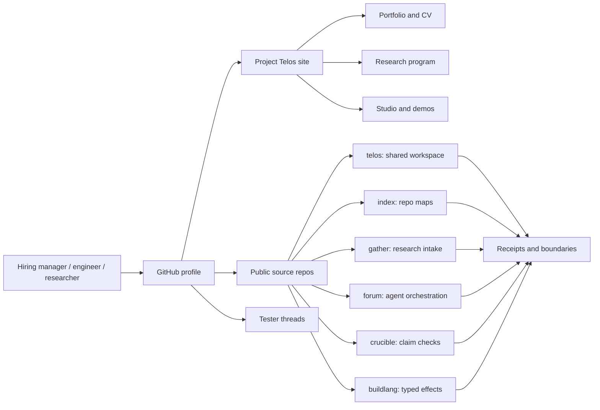
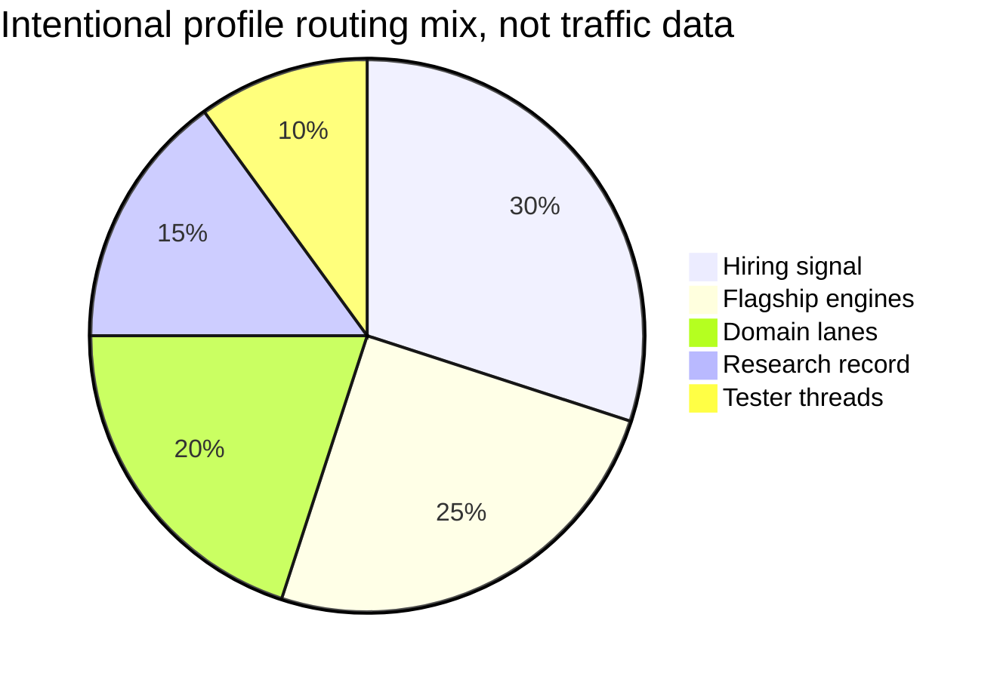

# Zain Dana Harper / Project Telos

<!-- markdownlint-disable MD013 MD026 MD033 -->


> Build with a model. Take nothing on faith.

I am **Zain Dana Harper**, a self-taught systems engineer in Seattle. I build
**Project Telos** as a research lab and product ecosystem for AI-era
engineering: shared human/model workspaces, research intake, repository
intelligence, agent orchestration, compilers, graphics, color, simulation, and
verification.

That sounds formal. The person behind it is not. I am artistic, restless,
fallible, and very capable of getting excited before I am right. A lot of this
work exists because I know how easy it is to fool myself: I make strange
connections, break my own claims, throw things away, and keep the parts that
survive being checked.

If you are hiring, the shortest read is this: I enter ambiguous technical
systems, map the moving parts, build the toolchain around them, and leave behind
artifacts that another engineer can inspect.

Evidence is the lab method, not the personality. The point is to move across
domains quickly, build useful instruments, make room for taste and intuition,
and keep the claims honest while the work expands.

**Site:** [harperz9.github.io](https://harperz9.github.io)

**Flagships:** [telos](https://github.com/HarperZ9/telos) | [index](https://github.com/HarperZ9/index) | [gather](https://github.com/HarperZ9/gather) | [forum](https://github.com/HarperZ9/forum) | [crucible](https://github.com/HarperZ9/crucible) | [emet](https://github.com/HarperZ9/emet) | [buildlang](https://github.com/HarperZ9/buildlang) | [learn](https://github.com/HarperZ9/learn)

**Work:** [resume](https://harperz9.github.io/resume.html) | [portfolio](https://harperz9.github.io/portfolio.html) | [research](https://harperz9.github.io/research.html)

## The human part.

I like beautiful systems, strange edges, visual tools, hard problems, and the
moment when a messy idea finally becomes something another person can touch. I
also make mistakes. I overreach. I revise. I need tests, receipts, witnesses,
and public boundaries because they keep ambition from turning into theater.

The work is clean because the process is not. It is sketches, wrong turns,
argument with the machine, late-night debugging, aesthetic obsession, and a
steady effort to make the result useful to someone who was not there for the
mess.

## Why this profile is worth your time.

- I build across the stack: public sites, Python CLIs, Node demos, MCP tools,
  compiler experiments, C++/graphics work, docs, tests, and release surfaces.
- I use AI aggressively without handing it authority: every serious claim needs
  a source, receipt, test, or boundary.
- I am strongest where the problem is underspecified: new tools, research
  infrastructure, agent workflows, developer experience, and systems that need
  both imagination and discipline.
- I care about the feel of the thing: names, diagrams, colors, writing, error
  states, and whether a tool invites a person to keep thinking.
- I ship public artifacts, not just private screenshots: source repos, docs,
  issue threads, demos, verifiers, and a portfolio site you can inspect.

## Best-fit roles.

| Role lane | Why I fit |
| --- | --- |
| AI tooling / research infrastructure | I build source intake, context, evaluation, and receipt systems around model work. |
| Developer tools / platform engineering | I turn repeated workflows into CLIs, docs, checks, and public package surfaces. |
| Agent orchestration / evals | I design worker/verifier splits, routing ledgers, failure modes, and replayable decisions. |
| Systems / compilers / runtime experiments | I work below the app layer: typed effects, C/Rust/C++ paths, kernels, and runtime boundaries. |
| Graphics, color, and visual tooling | I connect rendering, calibration, GPU traces, perceptual color, and inspectable outputs. |

## Hiring manager fast path.

| Signal | Inspect first | What it shows |
| --- | --- | --- |
| Systems judgment | [Project Telos](https://github.com/HarperZ9/telos) | Product architecture around models, tools, receipts, and operator workflows. |
| Repository intelligence | [index](https://github.com/HarperZ9/index) | Large-workspace mapping, context envelopes, and source-backed architecture claims. |
| Research operations | [gather](https://github.com/HarperZ9/gather) | Provenance-aware intake for messy web, paper, media, and document sources. |
| Agent orchestration | [forum](https://github.com/HarperZ9/forum) | Multi-agent plans, routing, ledgers, and resumable handoffs. |
| Language/runtime depth | [buildlang](https://github.com/HarperZ9/buildlang) | Typed-effects systems language work with checked capability surfaces. |

## Inspect by time budget.

<details open>
<summary><strong>30 seconds: decide whether to keep reading</strong></summary>

Read the opening, scan the hiring table, and open the
[portfolio](https://harperz9.github.io/portfolio.html). The signal to look for:
one person building a coherent research/tooling ecosystem across domains, with
source links and verification paths kept visible.

</details>

<details>
<summary><strong>5 minutes: inspect the strongest artifacts</strong></summary>

Open [telos](https://github.com/HarperZ9/telos),
[index](https://github.com/HarperZ9/index), and
[gather](https://github.com/HarperZ9/gather). In each, look for the same
engineering habit: clear public purpose, runnable commands, receipts or tests,
and explicit boundaries around what is not proven.

</details>

<details>
<summary><strong>20 minutes: pressure-test the fit</strong></summary>

Read the [CV](https://harperz9.github.io/cv.html), follow one domain lane, and
open a tester thread. The question is not whether every line is finished; it is
whether the work shows enough range, judgment, and self-checking discipline to
justify a conversation.

</details>

<details open>
<summary><strong>Choose your path: hiring manager</strong></summary>

Start with the [resume](https://harperz9.github.io/resume.html), then open
`telos`, `index`, and `gather`. Look for the same pattern in each repo: a clear
claim, runnable surface, tests or receipts, and a public boundary around what is
not proven yet.

</details>

<details>
<summary><strong>Choose your path: engineer</strong></summary>

Run the verifier in this profile repo, then inspect one flagship package end to
end. Good first reads are `index` for architecture mapping, `gather` for source
intake, `forum` for orchestration, and `buildlang` for compiler/runtime work.

</details>

<details>
<summary><strong>Choose your path: researcher or collaborator</strong></summary>

Start at the [research page](https://harperz9.github.io/research.html), then
follow the domain lanes below. The valuable part is not a claim of expertise in
every field; it is a repeatable way to turn domain work into inspectable packets,
negative fixtures, and explicit uncertainty.

</details>

## Proof-of-work matrix.

| What I claim | Public evidence | First check |
| --- | --- | --- |
| I can map large code/workspace surfaces. | [index](https://github.com/HarperZ9/index) | Run a workspace map and compare it to the tree. |
| I can turn messy research inputs into usable packets. | [gather](https://github.com/HarperZ9/gather) | Capture a source and inspect its provenance receipt. |
| I can coordinate multi-agent work without losing the trail. | [forum](https://github.com/HarperZ9/forum) | Replay a ledgered decision path. |
| I can build language/runtime ideas, not only wrappers. | [buildlang](https://github.com/HarperZ9/buildlang) | Inspect typed effects and the checked C path. |
| I can make visual and native systems concrete. | [portfolio](https://harperz9.github.io/portfolio.html) | Follow the graphics, color, and Studio surfaces. |
| I can document uncertainty instead of hiding it. | [research](https://harperz9.github.io/research.html) | Look for `MATCH`, `DRIFT`, `UNVERIFIABLE`, and named gaps. |

## Map the work.

GitHub renders these as static diagrams. The site carries the fuller interactive
surfaces where GitHub's README sandbox cannot run JavaScript.

**Live surfaces:** [catalog](https://harperz9.github.io/catalog.html) | [flagships](https://harperz9.github.io/overview.html) | [studio](https://harperz9.github.io/studio.html) | [research](https://harperz9.github.io/research.html)





## Research lab, not a single tool.

The eight public engines are the current lab instruments. Each has the same
requirement: show its work, expose its boundary, and make the result possible
to check from outside the thing making the claim.

- **[the telos engine](https://github.com/HarperZ9/telos): perceive, make,
  simulate, and verify.** Shared human/model surface. First inspection: follow
  a demo back to its evidence.
- **[index](https://github.com/HarperZ9/index): map and verify.** Workspace
  maps, architecture certificates, and context envelopes. First inspection:
  run a map and compare it to the source tree.
- **[gather](https://github.com/HarperZ9/gather): intake and witness.**
  Research intake across web, feeds, docs, papers, PDFs, browser/OCR/audio
  paths, and APIs. First inspection: capture a source packet and inspect the
  receipt.
- **[forum](https://github.com/HarperZ9/forum): orchestrate.** Multi-agent
  work with a witnessed ledger. First inspection: replay a decision path from
  the ledger.
- **[crucible](https://github.com/HarperZ9/crucible): judge.** Claim checking
  and thesis refinement. First inspection: force a `MATCH`, `DRIFT`, or
  `UNVERIFIABLE` verdict.
- **[emet](https://github.com/HarperZ9/emet): witness.** External byte witness.
  First inspection: re-derive file bytes without trusting the file.
- **[buildlang](https://github.com/HarperZ9/buildlang): author.** Typed-effects
  systems language and scientific-runtime candidate. First inspection: inspect
  the checked effect surface and C path.
- **[learn](https://github.com/HarperZ9/learn): learn with receipts.** Learning
  and credential provenance. First inspection: run a graded stop with a receipt.

The site also documents the public-safe private-line group; source links appear
only where the public boundary is ready.

## Domain lanes.

The public docs now cover a research-lab surface, not a narrow accountability
tool. Current lanes include:

- **Formal and physical systems:** formal math, theorem replay, physics/PDEs,
  thermodynamic computing, quantum workflows, and numerical invariants.
- **AI4Science and labs:** biology/autonomous labs, materials and chemistry,
  scientific discovery handoffs, and research proof packets.
- **Infrastructure and risk:** robotics/control, energy grids, finance/systemic
  risk, epidemiology, and public-health modeling.
- **Perception and media:** rendering, GPU traces, display calibration,
  color-science measurement, creative engines, and visual proof packets.
- **Agent work and product surfaces:** browser evidence, MCP tools, action
  receipts, context envelopes, ledgers, and the public site/profile handoff.

The dogfood rule is aggressive: use `index` to map the workspace, `gather` to
capture sources, `forum` to route work, `crucible` to attack claims, and `telos`
to record the receipt. When a lane is not ready, the docs should say so.

## One engineer, an unusual span.

The accountability line is a core method, not the whole body of work.

- **AI accountability:** provenance receipts, claim checks, MCP surfaces,
  agent routing, model-boundary discipline, and public verification paths.
- **Systems and compilers:** Python tooling, Rust and C++ systems work,
  compiler/runtime experiments, typed effects, and release gates.
- **Graphics and reverse engineering:** D3D11, HLSL, proxy-DLL interception,
  runtime instrumentation, game-state extraction, and native integrity work.
- **Color and calibration:** ICC, 3D LUTs, perceptual color, tone mapping,
  CIEDE2000, Oklab, CAT16, and color-vision simulation.
- **Public product shipping:** Elder ENB on
  [NexusMods](https://www.nexusmods.com/skyrimspecialedition/mods/117327),
  Project Telos on GitHub, and a site where every page links to its source.
- **Research operations:** domain packets, adversarial testing, negative
  fixtures, receipt ledgers, and public docs that mark what is verified,
  experimental, or still unproven.

The personality of the work is direct: ambitious systems, clean public surfaces,
artistic instincts, visible uncertainty, and no claim that cannot survive being
checked.

## Test the floor.

Project Telos needs people willing to use the engines against real workflows,
break the receipt discipline, and report where the proof surface fails.

Open tester threads:

- [Test gather intake](https://github.com/HarperZ9/gather/issues/1)
- [Test index maps](https://github.com/HarperZ9/index/issues/13)
- [Test forum ledgers](https://github.com/HarperZ9/forum/issues/1)
- [Test crucible checks](https://github.com/HarperZ9/crucible/issues/1)
- [Test the telos surface](https://github.com/HarperZ9/telos/issues/2)

## For developers

This repository publishes the `HarperZ9` GitHub profile README. The profile
stays deliberately static: no badge wall, no visitor counters, no dynamic SVG
decoration. The source, site, and verifier are the moving parts.

```powershell
git status --short
python scripts/check_profile_surface.py
```

Build it to be checked, or do not ship it.
