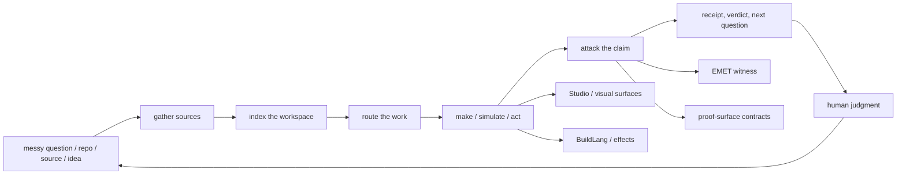
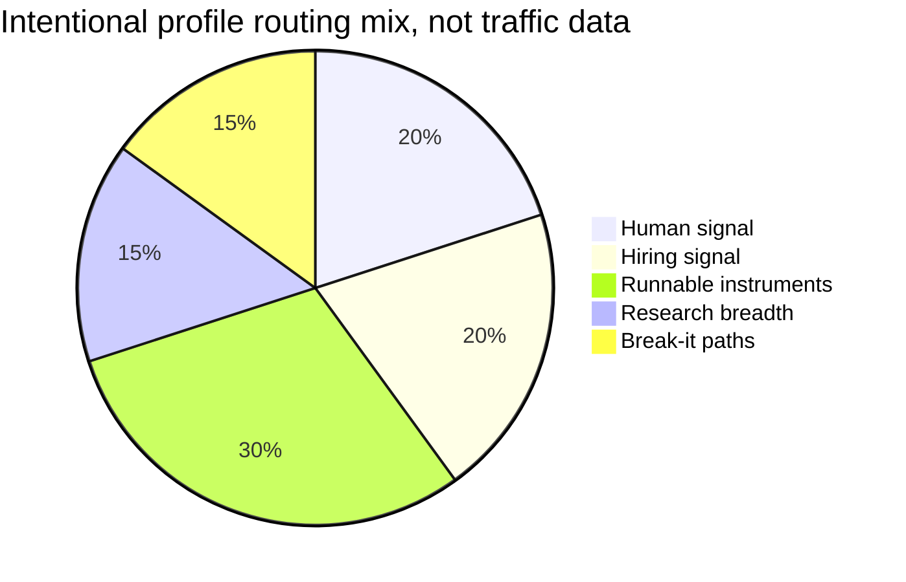

# Zain Dana Harper / Project Telos

<!-- markdownlint-disable MD013 MD026 MD033 -->


> Build with a model. Take nothing on faith.

This is a workbench, not a trophy case.

I am **Zain Dana Harper**, a self-taught systems engineer in Seattle. I build
**Project Telos** as a cross-domain **research lab and product ecosystem** for
AI-era work: source intake, workspace maps, agent ledgers, claim checks,
compiler experiments, graphics, color, simulation, learning workflows, and the
receipts that make the whole thing inspectable.

The clean surface is a little misleading. The person at the bench is artistic,
restless, fallible, stubborn, and very capable of sprinting after a beautiful
wrong idea. I build verification systems because I need them. I make strange
connections, take wrong turns, argue with the machine, get humbled by tests,
and keep the parts that survive being checked.

If you are hiring, the useful signal is not that I can use AI. It is that I can
turn ambiguous technical work into instruments another engineer can run, read,
break, and improve.

I also care about the strange parts: color, rhythm, names, diagrams, tiny
interaction details, old rendering tricks, and the feeling that a tool has a
person behind it. I want the work to be serious without pretending the maker is
made of glass and policy documents.

**Site:** [harperz9.github.io](https://harperz9.github.io)

**Work:** [resume](https://harperz9.github.io/resume.html) | [portfolio](https://harperz9.github.io/portfolio.html) | [CV](https://harperz9.github.io/cv.html) | [research](https://harperz9.github.io/research.html) | [Studio](https://harperz9.github.io/studio.html)

**Flagships:** [telos](https://github.com/HarperZ9/telos) | [index](https://github.com/HarperZ9/index) | [gather](https://github.com/HarperZ9/gather) | [forum](https://github.com/HarperZ9/forum) | [crucible](https://github.com/HarperZ9/crucible) | [emet](https://github.com/HarperZ9/emet) | [buildlang](https://github.com/HarperZ9/buildlang) | [learn](https://github.com/HarperZ9/learn)

## Choose a door.

<details open>
<summary><strong>I have 30 seconds.</strong></summary>

Open the [portfolio](https://harperz9.github.io/portfolio.html), then skim the
instrument table below. The pattern to look for: one builder turning AI work,
research, codebases, and creative systems into artifacts with receipts,
boundaries, and runnable surfaces.

</details>

<details>
<summary><strong>I am hiring for AI tooling or platform work.</strong></summary>

Start with [telos](https://github.com/HarperZ9/telos),
[index](https://github.com/HarperZ9/index), and
[gather](https://github.com/HarperZ9/gather). I am strongest where the problem
is underspecified: agent workflows, research infrastructure, developer tools,
source-grounded systems, and products that need both taste and discipline.

</details>

<details>
<summary><strong>I am an engineer and want proof.</strong></summary>

Run this profile verifier, then inspect one flagship end to end:

```powershell
git clone https://github.com/HarperZ9/HarperZ9
cd HarperZ9
python scripts/check_profile_surface.py
```

Good first checks: run an `index` map, capture a `gather` packet, replay a
`forum` ledger, force a `crucible` verdict, or inspect `buildlang` backend
maturity labels.

</details>

<details>
<summary><strong>I want the weird human part.</strong></summary>

I like systems that feel alive: visual tools, hard edges, careful names,
generative art, color science, old graphics pipelines, compiler guts, and the
moment when a messy private sketch becomes something another person can touch.
I also overreach. I revise. I need public boundaries because ambition without a
record turns into theater.

</details>

<details>
<summary><strong>I want to break it.</strong></summary>

Pick the claim that sounds too confident. Stale a map. Tamper with a receipt.
Force a model answer past its source. Make a demo return `UNVERIFIABLE` for the
right reason. The best feedback is the smallest reproducible case where the
proof surface fails.

</details>

## Showcases and demos.

<details open>
<summary><strong>Open something visual.</strong></summary>

Start with [The Studio](https://harperz9.github.io/studio.html). It is the live
surface of Project Telos: a person and a model perceive the same thing, shape
it, and check the result. The page includes the Atelier, 2D/3D fractals,
dimension work, bring-your-own media, music, and physics routes.

Then open the [catalog](https://harperz9.github.io/catalog.html) for the full
front door and the [flagship overview](https://harperz9.github.io/overview.html)
for the broader atlas.

</details>

<details>
<summary><strong>Run a tiny demo from source.</strong></summary>

These are not profile decorations; they are small runnable doors into the
workbench.

```powershell
git clone https://github.com/HarperZ9/telos
cd telos
node demo/run.mjs
```

```powershell
git clone https://github.com/HarperZ9/gather
cd gather
python examples/demo.py
```

```powershell
git clone https://github.com/HarperZ9/forum
cd forum
python examples/demo.py
```

</details>

<details>
<summary><strong>Inspect the demo surfaces.</strong></summary>

| Demo | Link | What to look for |
| --- | --- | --- |
| Studio | [live surface](https://harperz9.github.io/studio.html) | Visual creation, perception, and verification in one place. |
| Project catalog | [live atlas](https://harperz9.github.io/catalog.html) | The public map of engines, demos, and research surfaces. |
| Flagships | [overview](https://harperz9.github.io/overview.html) | How the engines fit together as peers. |
| Research | [current lanes](https://harperz9.github.io/research.html) | Domain packets, status notes, and explicit gaps. |
| BuildLang | [landing page](https://harperz9.github.io/buildlang/) | Effects-language compiler positioning and public route. |
| index | [atlas demo](https://github.com/HarperZ9/index/blob/main/examples/atlas-demo.html) | A code/docs map as an inspectable artifact. |
| gather | [proof surface](https://github.com/HarperZ9/gather/blob/main/examples/gather-demo.html) | Source intake with provenance receipts. |
| forum | [ledger replay](https://github.com/HarperZ9/forum/blob/main/examples/forum-demo.html) | Agent routing with a replayable record. |

</details>

<details>
<summary><strong>Pick a mood.</strong></summary>

- **I want craft:** open Studio, then read the graphics/color lane.
- **I want rigor:** run `python scripts/check_profile_surface.py`, then inspect
  `crucible`, `emet`, or `proof-surface`.
- **I want systems depth:** open BuildLang, `index`, and the C++/graphics notes.
- **I want the person:** read the weird-human door, then follow the portfolio
  and CV.

</details>

## Workbench quests.

Pick one path and press on it. Each quest is small enough to start in a few
minutes and specific enough to become a real interview conversation.

| Mode | Start here | Artifact you should get |
| --- | --- | --- |
| Make | [Studio](https://harperz9.github.io/studio.html) or `telos` | A visual state tied back to a source route. |
| Map | `index atlas` | A local HTML map of code and docs. |
| Capture | `gather docs` | A source packet with a receipt boundary. |
| Route | `forum route --json` | A routing decision you can replay. |
| Attack | `crucible` | A `MATCH`, `DRIFT`, or `UNVERIFIABLE` verdict. |
| Validate | [proof-surface](https://github.com/HarperZ9/proof-surface) | A contract suite that either passes or names the break. |

<details open>
<summary><strong>Quest 1: make the machine draw.</strong></summary>

Open [The Studio](https://harperz9.github.io/studio.html), pick a route, and
make something visual before you read another paragraph. Then pull the source
surface:

```powershell
git clone https://github.com/HarperZ9/telos
cd telos
node demo/run.mjs
```

This is the part of the work where my personality shows up fastest: image,
motion, old rendering instincts, names, and the refusal to let a beautiful
state float away without a record.

</details>

<details>
<summary><strong>Quest 2: map a workspace.</strong></summary>

Point `index` at a repo that has more knowledge than one person can keep in
their head:

```powershell
python -m pip install index-graph
index atlas --root C:\path\to\workspace --format html --out atlas.html
```

Open the HTML file and ask two questions: which edge surprised you, and which
doc no longer matches the code it claims to explain?

</details>

<details>
<summary><strong>Quest 3: capture a source.</strong></summary>

Give `gather` a small notes folder and make it preserve the method, scope, and
receipt instead of pretending the summary is the evidence:

```powershell
python -m pip install gather-engine
gather docs ./research-notes --scope "claim,evidence"
```

The interesting part is not whether it sounds polished. The interesting part
is whether you can still find the boundary between source, digest, and claim.

</details>

<details>
<summary><strong>Quest 4: replay an agent route.</strong></summary>

Make `forum` choose a lane without hiding the choice behind personality or
vibes:

```powershell
python -m pip install forum-engine
forum route --json "build the auth endpoint and the database schema"
```

Then change the prompt until the route changes. That edge case is where the
tool starts to become useful.

</details>

<details>
<summary><strong>Quest 5: force a verdict.</strong></summary>

Run `crucible` and look for the point where a confident sentence stops being
checkable:

```powershell
git clone https://github.com/HarperZ9/crucible
cd crucible
python examples/demo.py
```

I like this kind of tool because it is rude in the correct direction. It does
not care whether the claim is pretty. It asks whether the claim survived the
measurement surface.

</details>

<details>
<summary><strong>Quest 6: validate a contract.</strong></summary>

Pull [proof-surface](https://github.com/HarperZ9/proof-surface) and make the
contract speak through tests:

```powershell
git clone https://github.com/HarperZ9/proof-surface
cd proof-surface
python -m pip install -e .
python -m pytest -q
```

This is the boring-looking part that keeps the interesting parts honest.

</details>

## Conversation starters.

- Ask me to map a messy repo in real time.
- Ask me where a model answer should turn into `UNVERIFIABLE`.
- Ask me what I overbuilt, what I cut, and what I still miss.
- Ask me why visual tools, compiler boundaries, and receipts keep showing up
  in the same room.
- Ask me for the smallest demo that would make you trust one of these systems
  less.

## The instruments.

| If you want to... | Open | What it proves first |
| --- | --- | --- |
| Make AI work inspectable | [telos](https://github.com/HarperZ9/telos) | Shared human/model workspace, MCP tools, Studio surfaces, browser evidence, and replayable receipts. |
| See a codebase as a map | [index](https://github.com/HarperZ9/index) | Workspace atlas, dependency evidence, freshness checks, and context envelopes. |
| Bring messy sources inside | [gather](https://github.com/HarperZ9/gather) | Method-labeled intake for web, docs, feeds, papers, PDFs, browser/OCR/audio paths, APIs, and derived notes. |
| Route agent work without losing the trail | [forum](https://github.com/HarperZ9/forum) | Ledgers, budgets, route records, resume state, intent checks, and verifier seams. |
| Attack a claim | [crucible](https://github.com/HarperZ9/crucible) | `MATCH`, `DRIFT`, or `UNVERIFIABLE`, with the boundary visible. |
| Witness bytes from outside the claim | [emet](https://github.com/HarperZ9/emet) | Source/view consistency across independent conformance vectors. |
| Work below the app layer | [buildlang](https://github.com/HarperZ9/buildlang) | Rust compiler, typed effects, C as verified path, shader backends, and LSP surface. |
| Learn without bypassing the human | [learn](https://github.com/HarperZ9/learn) | Credential and coursework workflows that halt at graded steps and witness boundaries. |

## The map.

GitHub renders this as a static diagram. The live surfaces are on the site:
[catalog](https://harperz9.github.io/catalog.html),
[flagships](https://harperz9.github.io/overview.html),
[studio](https://harperz9.github.io/studio.html), and
[research](https://harperz9.github.io/research.html).





## What I am unusually good at.

- Entering ambiguous technical systems and finding the moving parts.
- Turning repeated workflows into CLIs, checks, docs, package surfaces, and
  public handoff contracts.
- Keeping AI useful without treating model output as authority.
- Working across Python, Rust, JavaScript, C++, graphics/native systems,
  compiler ideas, docs, and product surfaces.
- Caring about the feel of the thing: names, diagrams, colors, error states,
  alt text, scan paths, and whether the tool invites a person to keep thinking.

## Bench notes.

<details>
<summary><strong>Things I keep reaching for.</strong></summary>

Color systems. Compiler boundaries. Old graphics pipelines. Small local tools.
Diagrams that make a system less lonely. Receipts. Beautiful names. Harsh tests.
Interfaces that feel quiet until they need to speak.

</details>

<details>
<summary><strong>Things I am still learning in public.</strong></summary>

How to make a very broad research lab legible without flattening it. How to
keep ambition from becoming posture. How to let AI help without letting it
launder uncertainty. How to make demos feel alive while still leaving a trail
another person can check.

</details>

<details>
<summary><strong>Things that usually mean I am doing the right work.</strong></summary>

The first version is too strange. The second version is too clean. The third
version has a test, a name, a diagram, a rough edge I still like, and a small
door someone else can open.

</details>

## What I am not pretending.

- A broad research lab is not the same thing as finished expertise in every
  domain. Some lanes are mature tools; some are proof packets; some are
  experiments with explicit gaps.
- A receipt is not truth. It is a way to preserve enough state that another
  person can check what happened.
- A model is not a coworker, a judge, or a source of authority. It is a powerful
  instrument that needs memory, senses, brakes, and a record.
- I am not polished all the way down. I am a human trying to build clean
  instruments from a messy interior life.

## Domain lanes.

The accountability line is the method, not the whole body of work.

- **AI accountability:** provenance receipts, claim checks, MCP surfaces, agent
  routing, model-boundary discipline, and public verification paths.
- **Research operations:** source capture, domain packets, adversarial testing,
  negative fixtures, and docs that mark what is verified, experimental, or
  unproven.
- **Systems and compilers:** Python tooling, Rust and C++ systems work,
  compiler/runtime experiments, typed effects, codegen, and release gates.
- **Graphics and color:** D3D11, HLSL, GPU traces, display calibration, ICC, 3D
  LUTs, perceptual color, Oklab, CAT16, and color-vision simulation.
- **Formal and physical systems:** theorem replay, physics/PDEs, thermodynamic
  computing, quantum workflows, numerical invariants, and AI4Science packets.
- **Public product shipping:** Project Telos on GitHub, Elder ENB on
  [NexusMods](https://www.nexusmods.com/skyrimspecialedition/mods/117327), and
  a site where public pages link back to source.

## Open traps.

Project Telos needs people willing to use the engines against real workflows,
break the receipt discipline, and report where the proof surface fails.

- [Test gather intake](https://github.com/HarperZ9/gather/issues/1)
- [Test index maps](https://github.com/HarperZ9/index/issues/13)
- [Test forum ledgers](https://github.com/HarperZ9/forum/issues/1)
- [Test crucible checks](https://github.com/HarperZ9/crucible/issues/1)
- [Test the telos surface](https://github.com/HarperZ9/telos/issues/2)

## How this profile is built.

This README is part of the workbench. It has a local verifier, CI, a template
research receipt, an index-backed scope assessment, and a market/telemetry
receipt. It stays deliberately static: no badge wall, no visitor counter, no
typing SVG, and no dashboard that silently rots.

- [enterprise profile receipt](docs/research/2026-07-01-enterprise-profile-research.md)
- [profile template research](docs/research/2026-07-01-profile-template-research.md)
- [index scope assessment](docs/research/2026-07-01-index-scope-assessment.md)

```powershell
git status --short
python scripts/check_profile_surface.py
```

Build it to be checked, or do not ship it.
