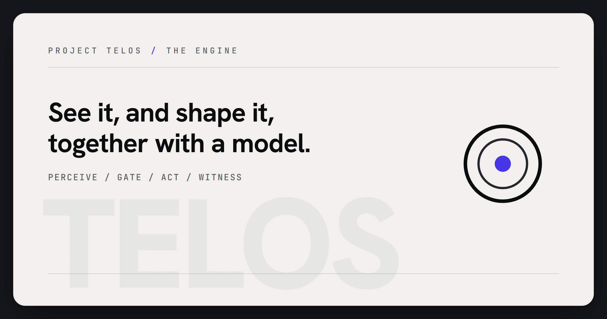

# Zain Dana Harper / Project Telos

<!-- markdownlint-disable MD013 MD026 MD033 -->



> Build with a model. Take nothing on faith.

I am **Zain Dana Harper**, a self-taught systems engineer in Seattle. I build
proof-first engines for working alongside AI without treating the model's
confidence as authority.

This profile is the GitHub front door. Start at the site, inspect the source,
then test the tools where their claims meet real workflows.

**Site:** [harperz9.github.io](https://harperz9.github.io)

**Flagships:** [telos](https://github.com/HarperZ9/telos) | [index](https://github.com/HarperZ9/index) | [gather](https://github.com/HarperZ9/gather) | [forum](https://github.com/HarperZ9/forum) | [crucible](https://github.com/HarperZ9/crucible) | [emet](https://github.com/HarperZ9/emet) | [buildlang](https://github.com/HarperZ9/buildlang) | [learn](https://github.com/HarperZ9/learn)

**Work:** [resume](https://harperz9.github.io/resume.html) | [portfolio](https://harperz9.github.io/portfolio.html) | [research](https://harperz9.github.io/research.html)

## Eight engines, equal standing.

Each engine has the same requirement: show its work, expose its boundary, and
make the result possible to check from outside the thing making the claim.

- **[the telos engine](https://github.com/HarperZ9/telos): perceive and make.**
  Shared human/model surface. First inspection: follow a demo back to its
  evidence.
- **[index](https://github.com/HarperZ9/index): map and verify.** Workspace
  maps and architecture certificates. First inspection: run a map and compare
  it to the source tree.
- **[gather](https://github.com/HarperZ9/gather): intake and witness.**
  Research intake with provenance receipts. First inspection: capture a source
  packet and inspect the receipt.
- **[forum](https://github.com/HarperZ9/forum): orchestrate.** Multi-agent
  work with a witnessed ledger. First inspection: replay a decision path from
  the ledger.
- **[crucible](https://github.com/HarperZ9/crucible): judge.** Claim checking
  and thesis refinement. First inspection: force a `MATCH`, `DRIFT`, or
  `UNVERIFIABLE` verdict.
- **[emet](https://github.com/HarperZ9/emet): witness.** External byte witness.
  First inspection: re-derive file bytes without trusting the file.
- **[buildlang](https://github.com/HarperZ9/buildlang): author.** Typed-effects
  systems language. First inspection: inspect the checked effect surface and C
  path.
- **[learn](https://github.com/HarperZ9/learn): learn with receipts.** Learning
  and credential provenance. First inspection: run a graded stop with a receipt.

The site also documents the public-safe private-line group; source links appear
only where the public boundary is ready.

## One engineer, an unusual span.

The accountability line is the current focus, not the whole body of work.

- **AI accountability:** provenance receipts, claim checks, MCP surfaces,
  agent routing, model-boundary discipline, and public verification paths.
- **Systems and compilers:** Python tooling, Rust and C++ systems work,
  compiler/runtime experiments, typed effects, and release gates.
- **Graphics and reverse engineering:** D3D11, HLSL, proxy-DLL interception,
  runtime instrumentation, game-state extraction, and native integrity work.
- **Color and calibration:** ICC, 3D LUTs, perceptual color, tone mapping,
  CIEDE2000, Oklab, CAT16, and color-vision simulation.
- **Public product shipping:** Elder ENB on
  [NexusMods](https://www.nexusmods.com/skyrimspecialedition/mods/117327),
  Project Telos on GitHub, and a site where every page links to its source.

The personality of the work is direct: ambitious systems, clean public surfaces,
and no claim that cannot survive being checked.

## Test the floor.

Project Telos needs people willing to use the engines against real workflows,
break the receipt discipline, and report where the proof surface fails.

Open tester threads:

- [Test gather intake](https://github.com/HarperZ9/gather/issues/1)
- [Test index maps](https://github.com/HarperZ9/index/issues/13)
- [Test forum ledgers](https://github.com/HarperZ9/forum/issues/1)
- [Test crucible checks](https://github.com/HarperZ9/crucible/issues/1)
- [Test the telos surface](https://github.com/HarperZ9/telos/issues/2)

## For developers

This repository publishes the `HarperZ9` GitHub profile README. The profile
stays deliberately static: no badge wall, no visitor counters, no dynamic SVG
decoration. The source, site, and verifier are the moving parts.

```powershell
git status --short
python scripts/check_profile_surface.py
```

Build it to be checked, or do not ship it.
