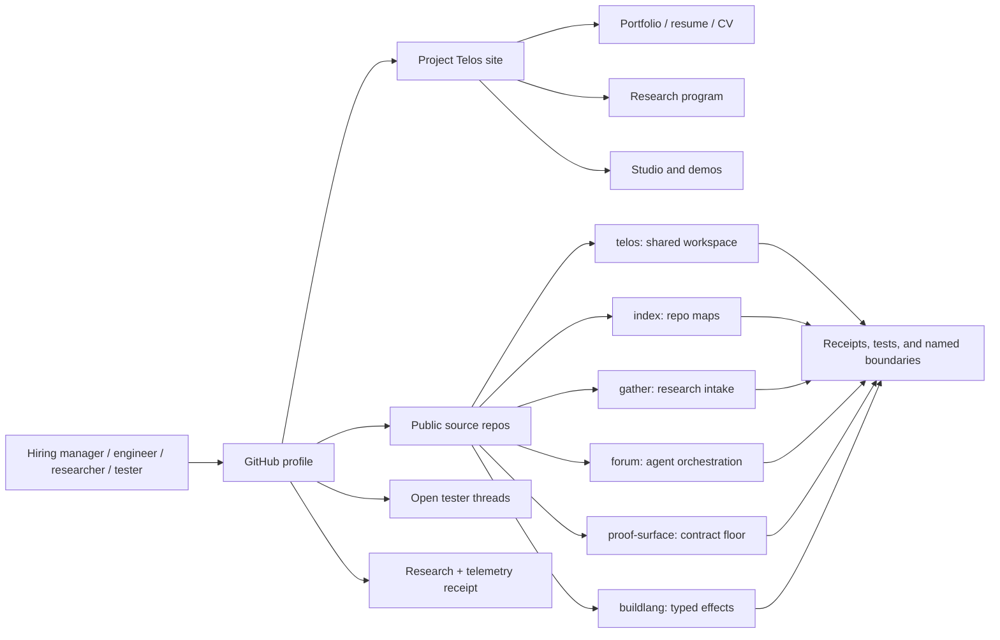
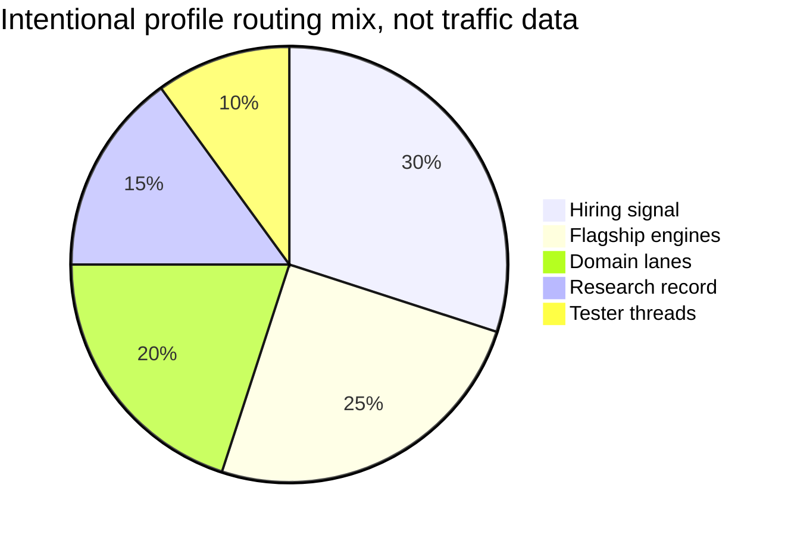

# Zain Dana Harper / Project Telos

<!-- markdownlint-disable MD013 MD026 MD033 -->


> Build with a model. Take nothing on faith.

I am **Zain Dana Harper**, a self-taught systems engineer in Seattle building
**Project Telos**: a cross-domain **research lab and product ecosystem** for
AI-era work. The lab instruments cover source intake, workspace maps, agent
orchestration, claim checks, compiler experiments, graphics, color, simulation,
learning workflows, and the receipts that let another person inspect what
happened.

The short version for hiring teams: AI fluency is becoming table stakes. My edge
is the layer around it: systems judgment, verification, taste, toolmaking, and
the ability to turn ambiguous technical work into artifacts another engineer
can run, read, challenge, and improve.

The human version matters too. I am artistic, restless, fallible, and very good
at getting excited before I am right. A lot of the discipline in this work
exists because I know how easy it is to fool myself. I make strange connections,
take wrong turns, argue with the machine, throw away weak ideas, and keep the
parts that survive being checked.

Evidence is the lab method, not the personality. The personality is curiosity,
aesthetic obsession, stubbornness, care for the person on the other side of the
tool, and a refusal to pretend uncertainty is cleaner than it is.

**Site:** [harperz9.github.io](https://harperz9.github.io)

**Work:** [resume](https://harperz9.github.io/resume.html) | [portfolio](https://harperz9.github.io/portfolio.html) | [CV](https://harperz9.github.io/cv.html) | [research](https://harperz9.github.io/research.html) | [Studio](https://harperz9.github.io/studio.html)

**Flagships:** [telos](https://github.com/HarperZ9/telos) | [index](https://github.com/HarperZ9/index) | [gather](https://github.com/HarperZ9/gather) | [forum](https://github.com/HarperZ9/forum) | [crucible](https://github.com/HarperZ9/crucible) | [emet](https://github.com/HarperZ9/emet) | [buildlang](https://github.com/HarperZ9/buildlang) | [learn](https://github.com/HarperZ9/learn)

## Hiring manager fast path.

| Signal | Inspect first | What to look for |
| --- | --- | --- |
| AI tooling / research infrastructure | [Project Telos](https://github.com/HarperZ9/telos) | Shared workspaces, MCP tools, model-foundry lanes, receipts, and public demo surfaces. |
| Large-workspace judgment | [index](https://github.com/HarperZ9/index) | Source-backed architecture maps, context envelopes, freshness checks, and atlas output. |
| Research operations | [gather](https://github.com/HarperZ9/gather) | Provenance-aware intake across web, docs, feeds, papers, PDFs, browser/OCR/audio paths, and derived notes. |
| Agent orchestration / evals | [forum](https://github.com/HarperZ9/forum) | Ledgered plans, routing, resume state, budget gates, intent checks, and verifier seams. |
| Systems / compilers / runtime experiments | [buildlang](https://github.com/HarperZ9/buildlang) | Rust compiler work, typed effects, C/HLSL/GLSL backends, LSP surface, and receipt-backed codegen. |

## Why this profile is worth your time.

- I am strongest where the problem is underspecified: new tools, research
  infrastructure, agent workflows, developer experience, and systems that need
  both imagination and discipline.
- I ship public artifacts instead of only screenshots: repos, docs, issues,
  demos, verifiers, tester threads, release surfaces, and a site that links
  back to source.
- I use AI aggressively without handing it authority: every serious claim needs
  a source, receipt, test, boundary, or a plain `UNVERIFIABLE`.
- I work across layers: Python CLIs, Node demos, Rust compiler work, C++ and
  graphics paths, docs, UX writing, design systems, and CI gates.
- I care how the thing feels: names, diagrams, colors, error states, scan paths,
  alt text, and whether a tool invites a person to keep thinking.

## Best-fit roles.

| Role lane | Why I fit |
| --- | --- |
| AI tooling / research infrastructure | I build source intake, context, evaluation, and receipt systems around model work. |
| Developer tools / platform engineering | I turn repeated workflows into CLIs, docs, checks, package surfaces, and handoff contracts. |
| Agent orchestration / evals | I design worker/verifier splits, routing ledgers, failure modes, replayable decisions, and stop conditions. |
| Systems / compilers / runtime experiments | I work below the app layer: typed effects, C/Rust/C++ paths, codegen, kernels, and runtime boundaries. |
| Graphics, color, and visual tooling | I connect rendering, calibration, GPU traces, perceptual color, and inspectable creative outputs. |

## The human part.

I like beautiful systems, strange edges, visual tools, hard problems, and the
moment when a messy idea finally becomes something another person can touch. I
also make mistakes. I overreach. I revise. I need tests, receipts, witnesses,
and public boundaries because they keep ambition from turning into theater.

The work is clean because the process is not. It is sketches, wrong turns,
argument with the machine, late-night debugging, aesthetic obsession, half-built
experiments, and a steady effort to make the result useful to someone who was
not there for the mess.

## Inspect by time budget.

<details open>
<summary><strong>30 seconds: decide whether to keep reading</strong></summary>

Read the opening, scan the hiring table, and open the
[portfolio](https://harperz9.github.io/portfolio.html). The signal to look for:
one person building a coherent research/tooling ecosystem across domains, with
source links and verification paths kept visible.

</details>

<details>
<summary><strong>5 minutes: inspect the strongest artifacts</strong></summary>

Open [telos](https://github.com/HarperZ9/telos),
[index](https://github.com/HarperZ9/index), and
[gather](https://github.com/HarperZ9/gather). In each, look for the same
engineering habit: clear public purpose, runnable commands, receipts or tests,
and explicit boundaries around what is not proven.

</details>

<details>
<summary><strong>20 minutes: pressure-test the fit</strong></summary>

Read the [CV](https://harperz9.github.io/cv.html), follow one domain lane, and
open a tester thread. The question is not whether every line is finished; it is
whether the work shows enough range, judgment, taste, and self-checking
discipline to justify a conversation.

</details>

## Choose your path.

<details open>
<summary><strong>Choose your path: hiring manager</strong></summary>

Start with the [resume](https://harperz9.github.io/resume.html), then open
`telos`, `index`, and `gather`. Look for the same pattern in each repo: a clear
claim, runnable surface, tests or receipts, and a public boundary around what is
not proven yet.

</details>

<details>
<summary><strong>Choose your path: engineer</strong></summary>

Run the verifier in this profile repo, then inspect one flagship package end to
end. Good first reads are `index` for architecture mapping, `gather` for source
intake, `forum` for orchestration, `proof-surface` for contract validators, and
`buildlang` for compiler/runtime work.

</details>

<details>
<summary><strong>Choose your path: researcher or collaborator</strong></summary>

Start at the [research page](https://harperz9.github.io/research.html), then
follow the domain lanes below. The valuable part is not a claim of expertise in
every field; it is a repeatable way to turn domain work into inspectable
packets, negative fixtures, explicit uncertainty, and useful next questions.

</details>

<details>
<summary><strong>Choose your path: adversarial tester</strong></summary>

Pick a claim that sounds too confident. Try to break the source link, stale the
workspace map, tamper with a receipt, or force a model answer past its evidence.
The best feedback is not praise; it is the smallest reproducible case where the
proof surface fails.

</details>

## Signature systems.

- **[the telos engine](https://github.com/HarperZ9/telos): perceive, make,
  simulate, and verify.** Shared human/model surface for creation, simulation,
  research packets, MCP tools, browser evidence, Studio surfaces, and replayable
  receipts.
- **[index](https://github.com/HarperZ9/index): map and verify.** Large
  workspace maps, docs/code atlases, architecture certificates, freshness
  checks, and context envelopes for agents and teams.
- **[gather](https://github.com/HarperZ9/gather): intake and witness.**
  Source capture across web, feeds, docs, papers, PDFs, browser/OCR/audio
  paths, APIs, and derived notes with method labels and digest receipts.
- **[forum](https://github.com/HarperZ9/forum): orchestrate.** Multi-agent work
  through ledgers, route records, budget gates, resume state, intent checks, and
  verifier seams.
- **[crucible](https://github.com/HarperZ9/crucible): judge.** Claim checking
  and thesis refinement that returns `MATCH`, `DRIFT`, or `UNVERIFIABLE`.
- **[emet](https://github.com/HarperZ9/emet): witness.** External byte witness
  for source/view consistency across Python, Rust, and Node conformance vectors.
- **[buildlang](https://github.com/HarperZ9/buildlang): author.** Rust-built
  compiler for typed effects, systems experiments, C as the verified path, and
  shader-oriented HLSL/GLSL generation.
- **[learn](https://github.com/HarperZ9/learn): learn with receipts.** Learning
  and credential-provenance engine that halts at graded steps and witnesses
  action boundaries.

## Proof-of-work matrix.

| What I claim | Public evidence | First check |
| --- | --- | --- |
| I can map large code/workspace surfaces. | [index](https://github.com/HarperZ9/index) | Run a workspace map and compare it to the tree. |
| I can turn messy research inputs into usable packets. | [gather](https://github.com/HarperZ9/gather) | Capture a source and inspect its provenance receipt. |
| I can coordinate multi-agent work without losing the trail. | [forum](https://github.com/HarperZ9/forum) | Replay a ledgered decision path. |
| I can build language/runtime ideas, not only wrappers. | [buildlang](https://github.com/HarperZ9/buildlang) | Inspect typed effects, backend maturity labels, and checked C paths. |
| I can make visual and native systems concrete. | [portfolio](https://harperz9.github.io/portfolio.html) | Follow the graphics, color, and Studio surfaces. |
| I can document uncertainty instead of hiding it. | [research](https://harperz9.github.io/research.html) | Look for `MATCH`, `DRIFT`, `UNVERIFIABLE`, and named gaps. |

## Map the work.

GitHub renders these as static diagrams. The site carries the fuller interactive
surfaces where GitHub's README sandbox cannot run JavaScript.

**Live surfaces:** [catalog](https://harperz9.github.io/catalog.html) | [flagships](https://harperz9.github.io/overview.html) | [studio](https://harperz9.github.io/studio.html) | [research](https://harperz9.github.io/research.html)





## Domain lanes.

The public docs now cover a research-lab surface, not a narrow accountability
tool. Current lanes include:

- **Formal and physical systems:** formal math, theorem replay, physics/PDEs,
  thermodynamic computing, quantum workflows, numerical invariants, and typed
  capability effects.
- **AI4Science and labs:** biology/autonomous labs, materials and chemistry,
  scientific discovery handoffs, research proof packets, and learning-lab
  receipts.
- **Infrastructure and risk:** robotics/control, energy grids, finance/systemic
  risk, epidemiology, workflow harnesses, and operator-facing reliability.
- **Perception and media:** rendering, GPU traces, display calibration,
  color-science measurement, creative engines, and visual proof packets.
- **Agent work and product surfaces:** browser evidence, MCP tools, action
  receipts, context envelopes, ledgers, verifiers, and public site/profile
  handoffs.

The dogfood rule is aggressive: use `index` to map the workspace, `gather` to
capture sources, `forum` to route work, `crucible` to attack claims,
`proof-surface` to validate contracts, and `telos` to record the receipt. When a
lane is not ready, the docs should say so.

## One engineer, an unusual span.

The accountability line is a core method, not the whole body of work.

- **AI accountability:** provenance receipts, claim checks, MCP surfaces, agent
  routing, model-boundary discipline, and public verification paths.
- **Systems and compilers:** Python tooling, Rust and C++ systems work,
  compiler/runtime experiments, typed effects, codegen, and release gates.
- **Graphics and reverse engineering:** D3D11, HLSL, proxy-DLL interception,
  runtime instrumentation, game-state extraction, and native integrity work.
- **Color and calibration:** ICC, 3D LUTs, perceptual color, tone mapping,
  CIEDE2000, Oklab, CAT16, and color-vision simulation.
- **Public product shipping:** Elder ENB on
  [NexusMods](https://www.nexusmods.com/skyrimspecialedition/mods/117327),
  Project Telos on GitHub, and a site where public pages link to their source.
- **Research operations:** domain packets, adversarial testing, negative
  fixtures, receipt ledgers, and public docs that mark what is verified,
  experimental, or still unproven.

The personality of the work is direct: ambitious systems, clean public surfaces,
artistic instincts, visible uncertainty, and no claim that cannot survive being
checked.

## Test the floor.

Project Telos needs people willing to use the engines against real workflows,
break the receipt discipline, and report where the proof surface fails.

Open tester threads:

- [Test gather intake](https://github.com/HarperZ9/gather/issues/1)
- [Test index maps](https://github.com/HarperZ9/index/issues/13)
- [Test forum ledgers](https://github.com/HarperZ9/forum/issues/1)
- [Test crucible checks](https://github.com/HarperZ9/crucible/issues/1)
- [Test the telos surface](https://github.com/HarperZ9/telos/issues/2)

## How this profile is built.

This README is treated as a product surface. It has a local verifier, a CI gate,
a research receipt, an index-backed scope assessment, and a market/telemetry
receipt that shaped the current routing.

- Research and telemetry:
  [enterprise profile receipt](docs/research/2026-07-01-enterprise-profile-research.md)
- Prior template scan:
  [profile template research](docs/research/2026-07-01-profile-template-research.md)
- Scope correction:
  [index scope assessment](docs/research/2026-07-01-index-scope-assessment.md)

## For developers

This repository publishes the `HarperZ9` GitHub profile README. The profile
stays deliberately static: no badge wall, no visitor counters, no typing SVG,
and no dynamic dashboard that can silently rot. The source, site, research
docs, and verifier are the moving parts.

```powershell
git status --short
python scripts/check_profile_surface.py
```

Build it to be checked, or do not ship it.
