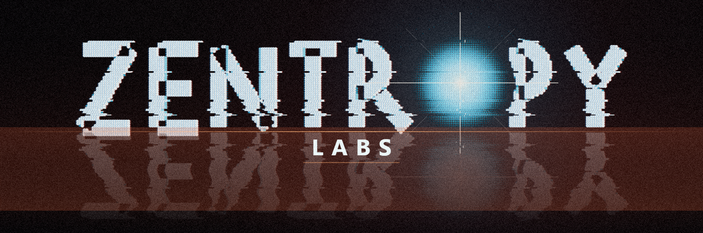

# Zain Dana Harper / ZentropyLabs.ai

<!-- markdownlint-disable MD013 MD033 -->

## Systems engineering, AI evaluation, and technical operations

I turn ambiguous systems into inspectable tools, tests, and handoffs. My work
spans model-neutral agent infrastructure, deterministic evaluation, developer
tools, native and browser graphics, technical writing, client operations, and
physical field work.

**Available for paid work:** full-time, contract, project, onsite, hybrid, or
remote. Based in Seattle, Washington.

[Hire / work](https://harperz9.github.io/hire.html) ·
[Resume](https://harperz9.github.io/resume.html) ·
[CV](https://harperz9.github.io/cv.html) ·
[Portfolio](https://harperz9.github.io/portfolio.html) ·
[LinkedIn](https://www.linkedin.com/in/zaindanaharper/) ·
[Email](mailto:zaindharper@gmail.com)

## Three ways to work together

| Path | Where I fit | Start here |
| --- | --- | --- |
| **Technical and evaluation** | Agent and model evaluation, developer infrastructure, systems integration, CI, security testing, technical support, and documentation. | [Engineering path](https://harperz9.github.io/hire.html#engineering-path) |
| **Public, union, and field** | Public service, ports, facilities, parks and grounds, arboriculture, client operations, scheduling, safety judgment, and physical work. | [Public-service and field path](https://harperz9.github.io/hire.html#public-service-field-path) |
| **Education and research** | Fellowships, labs, research operations, mentorship, continued learning, open-source work, and evidence-centered technical writing. | [Research and education](https://harperz9.github.io/research.html) |

## Evidence accepted upstream

These third-party results come before the owned product catalog because they
show the work surviving another maintainer's scope, review, and repository.

- [AgentFence PR 261](https://github.com/dgenio/agentfence/pull/261): an
  owner-approved and merged Go engine optimization with deterministic rule
  selection, allocation coverage, and green cross-platform checks.
- [Free Law Project PR 820](https://github.com/freelawproject/litigant-portal/pull/820):
  approved and merged documentation for running the fast DB-free test suite.
- [Mergewarden PR 107](https://github.com/sjh9714/mergewarden/pull/107):
  replay fixtures for reusable-workflow pinning, revised after owner review,
  approved, merged, and CI-checked.

## Capability constellation

**Flywheel is the sole primary platform.** The current verified release is
[Flywheel v0.3.10](https://github.com/HarperZ9/flywheel/releases/tag/v0.3.10):
one model-neutral workbench for routing, gated tool use, evaluation lanes,
receipts, memory, context, and reproducible workflows. The rest of the workshop
is organized as capability families, lanes, extensions, and bounded standalone
systems rather than a fixed flagship count.

| Family | Representative public work |
| --- | --- |
| **Agent systems** | [Flywheel](https://github.com/HarperZ9/flywheel), [Telos](https://github.com/HarperZ9/telos), [Forum](https://github.com/HarperZ9/forum), [Relay](https://github.com/HarperZ9/relay), [Mneme](https://github.com/HarperZ9/mneme) |
| **Evaluation and verification** | [Terminal State Fixtures](https://github.com/HarperZ9/terminal-state-fixtures), [Crucible](https://github.com/HarperZ9/crucible), [Emet](https://github.com/HarperZ9/emet) |
| **Security and privacy** | [Phantom](https://github.com/HarperZ9/phantom), authorized adversarial evaluation, privacy controls, and sanitized regression fixtures |
| **Developer infrastructure** | [BuildLang](https://github.com/HarperZ9/buildlang), [Index](https://github.com/HarperZ9/index), [Plexus](https://github.com/HarperZ9/plexus) |
| **Graphics and retro systems** | [Studio Engine](https://github.com/HarperZ9/studio-engine), [Build Color](https://github.com/HarperZ9/build-color), and the Retro Systems Lab |
| **Research and education** | [Gather](https://github.com/HarperZ9/gather), [Learn](https://github.com/HarperZ9/learn), and [publications](https://harperz9.github.io/publications.html) |

### Phantom's boundary

[Phantom v1.1.0](https://github.com/HarperZ9/phantom/releases/tag/v1.1.0)
ships reversible hardware-identity privacy controls for Windows and Linux. It
covers **Layer 2 identity surfaces**. Kernel and firmware layers are modeled but
not shipped end to end. Use is limited to machines the operator owns or is
expressly authorized to test.

### Authorized security, kept bounded

Authorized security work spans adversarial AI evaluation, system hardening,
privacy engineering, stress testing, regression fixtures, and coordinated
reporting. The public surface contains sanitized tests, schemas, detectors, and
bounded findings. Material that could enable misuse moves only through approved
private or embargoed channels with a defined scope and remediation owner.

## Retro Systems Lab

The lab follows **play → preserve → verify** while keeping each proof boundary
clear:

- [Retro Engine](https://harperz9.github.io/retro.html) is the interactive
  browser studio for owned pixel, palette, shader, and CRT experiments.
- [Engine Revival v0.1.0](https://github.com/HarperZ9/engine-revival/releases/tag/v0.1.0)
  is the public preservation and restoration-evidence spine.
- [BRender Archival v0.1.1](https://github.com/HarperZ9/brender-archival/releases/tag/v0.1.1)
  carries the specific BRender restoration record. Generic retro visuals are
  not presented as BRender evidence.

## How I work

Map the real state. Reduce the uncertainty to an executable check. Build the
missing surface. Record what the result proves and what it does not. Leave an
artifact another person can run, inspect, maintain, or safely operate.

For a role-specific view, use the [hiring page](https://harperz9.github.io/hire.html).
For the deeper record, use the [portfolio](https://harperz9.github.io/portfolio.html)
or [public capability atlas](https://harperz9.github.io/catalog.html).
