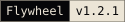
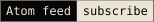
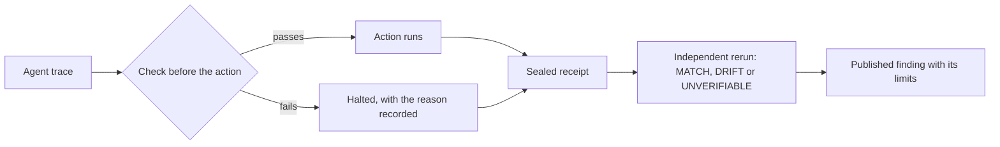

<!-- markdownlint-disable MD013 MD033 MD041 -->

<a href="https://harperz9.github.io/">
  <picture>
    <source media="(prefers-color-scheme: dark)" srcset="docs/art/hero-dark.svg">
    <source media="(prefers-color-scheme: light)" srcset="docs/art/hero-light.svg">
    
  </picture>
</a>

<p>
  <a href="https://github.com/HarperZ9/flywheel/releases/latest"></a>
  <a href="https://github.com/HarperZ9/articulate/releases/latest"></a>
  <a href="https://github.com/HarperZ9/telos/releases/latest"></a>
  <a href="https://harperz9.github.io/publications.html"></a>
  <a href="https://harperz9.github.io/feed.xml"></a>
</p>

I'm Zain Dana Harper. I build tools that let anyone recheck what an AI system
did, and I publish investigations into who knew about AI incidents first and
who pays the people who check. I work independently as a sole proprietor in
Kent, Washington, and I take scoped evaluation work.

A result is worth trusting when an outside skeptic can rerun the check on their
own machine and reach the same verdict. That holds whoever ran the model:
any lab, open or closed, any company, any nation. My own verdicts get the same
treatment.

| Pick a door | Go |
| --- | --- |
| Run an AI task with any model and keep a record you can recheck | [Flywheel and the flagships](#flywheel-and-the-flagships) |
| Read the investigations | [Who Knew First and the series](#who-knew-first-and-the-series) |
| See where the work is heading | [Watching the trace, checking before the action](#watching-the-trace-checking-before-the-action) |
| Hire me for evaluation work | [Work with me](#work-with-me) |
| Get in touch | [Reach me](#reach-me) |


## Flywheel and the flagships

<a href="https://harperz9.github.io/flywheel.html">
  <picture>
    <source media="(prefers-color-scheme: dark)" srcset="docs/art/verdicts-dark.svg">
    <source media="(prefers-color-scheme: light)" srcset="docs/art/verdicts-light.svg">
    
  </picture>
</a>

[Flywheel](https://github.com/HarperZ9/flywheel) is a self-hostable,
model-agnostic AI workstation and coding harness. It runs any model, frontier
or local, behind one OpenAI-compatible surface, with your keys and data kept on
your machine. Rowan, the desktop assistant, turns a plain request into a
recorded run. Relay runs a permission-gated coding agent over your own folders.
Lanes add research intake, workspace maps, memory, agent routing and writing.
`flywheel check-output` checks answers against finance, medicine and law packs
and can emit Lean 4 proofs. Every accepted run leaves a sealed receipt that an
independent witness reruns offline, with no learned model deciding the verdict.

```text
pip install flywheel-verify
flywheel up
flywheel lanes --probe
```

On the shipped benchmark the verified loop shows no measured accuracy gain over
a single pass; the interval includes zero. The value is the workstation and a
record you can check yourself. Flywheel is source-available under FSL-1.1-MIT.

Each flagship below also works on its own and plugs into Flywheel.

<details>
<summary><b>Current release of every flagship</b> (refreshed daily from GitHub)</summary>

<!-- releases:start -->
| Tool | What it does | Release |
| --- | --- | --- |
| [Flywheel](https://github.com/HarperZ9/flywheel) | AI workstation and coding harness: any model, gated agent, rerunnable receipts | [v1.2.1](https://github.com/HarperZ9/flywheel/releases/tag/v1.2.1) (2026-10-02) |
| [Articulate](https://github.com/HarperZ9/articulate) | Local writing checker and editor with content-free receipts | [v0.7.0](https://github.com/HarperZ9/articulate/releases/tag/v0.7.0) (2026-10-01) |
| [Telos](https://github.com/HarperZ9/telos) | Accountable actuation: senses, actions and hardware control in permission tiers | [v0.7.0](https://github.com/HarperZ9/telos/releases/tag/v0.7.0) (2026-10-02) |
| [Accountable Surface](https://github.com/HarperZ9/accountable-surface) | Gates agent actions on explicit grants, with a hash-chained journal | [v0.2.0](https://github.com/HarperZ9/accountable-surface/releases/tag/v0.2.0) (2026-09-18) |
| [Forum](https://github.com/HarperZ9/forum) | Coordinates agent teams with a replayable ledger | [v1.16.0](https://github.com/HarperZ9/forum/releases/tag/v1.16.0) (2026-10-01) |
| [Relay](https://github.com/HarperZ9/relay) | Permission-checked coding agent for any model endpoint | [v0.6.0](https://github.com/HarperZ9/relay/releases/tag/v0.6.0) (2026-10-01) |
| [Gather](https://github.com/HarperZ9/gather) | Research intake from the web, papers, video, scans and audio, with provenance | [v2.1.0](https://github.com/HarperZ9/gather/releases/tag/v2.1.0) (2026-10-01) |
| [Index](https://github.com/HarperZ9/index) | Offline repository and workspace maps with file and line evidence | [v2.15.0](https://github.com/HarperZ9/index/releases/tag/v2.15.0) (2026-10-01) |
| [Mneme](https://github.com/HarperZ9/mneme) | Agent memory where every recall can be rechecked | [v0.6.0](https://github.com/HarperZ9/mneme/releases/tag/v0.6.0) (2026-10-01) |
| [Canon](https://github.com/HarperZ9/canon) | One memory and personality record shared across models and tools | [v0.6.0](https://github.com/HarperZ9/canon/releases/tag/v0.6.0) (2026-10-01) |
| [Crucible](https://github.com/HarperZ9/crucible) | Tests falsifiable claims and records MATCH, DRIFT or UNVERIFIABLE | [v1.4.0](https://github.com/HarperZ9/crucible/releases/tag/v1.4.0) (2026-10-01) |
| [EMET](https://github.com/HarperZ9/emet) | Checks that bytes reaching a model still match their source | [v1.3.0](https://github.com/HarperZ9/emet/releases/tag/v1.3.0) (2026-09-13) |
| [Learn](https://github.com/HarperZ9/learn) | Turns your own material into a course that never takes the test for you | [v2.1.0](https://github.com/HarperZ9/learn/releases/tag/v2.1.0) (2026-10-01) |
| [Plexus](https://github.com/HarperZ9/plexus) | Finds and wires compatible tools in an agent toolchain | [v0.3.0](https://github.com/HarperZ9/plexus/releases/tag/v0.3.0) (2026-10-01) |
| [Phantom](https://github.com/HarperZ9/phantom) | Reversible hardware-identity privacy for owned Windows and Linux machines | [v1.1.1](https://github.com/HarperZ9/phantom/releases/tag/v1.1.1) (2026-09-10) |
<!-- releases:end -->

</details>

<details>
<summary><b>Work accepted upstream</b></summary>

Changes that survived another maintainer's review and merged:

- [AgentFence PR 261](https://github.com/dgenio/agentfence/pull/261): a Go engine optimization with deterministic rule selection and allocation coverage.
- [Free Law Project PR 820](https://github.com/freelawproject/litigant-portal/pull/820): documentation for the fast database-free test suite.
- [Mergewarden PR 107](https://github.com/sjh9714/mergewarden/pull/107): replay fixtures for reusable-workflow pinning, revised after owner review.

The [portfolio](https://harperz9.github.io/portfolio.html) lists merged, open and
closed contributions separately.

</details>


## Who Knew First and the series

<a href="https://harperz9.github.io/who-knew-first.html">
  <picture>
    <source media="(prefers-color-scheme: dark)" srcset="docs/art/incidents-dark.svg">
    <source media="(prefers-color-scheme: light)" srcset="docs/art/incidents-light.svg">
    
  </picture>
</a>

[Who Knew First](https://harperz9.github.io/who-knew-first.html) is a record of
nine 2026 incidents in which an AI agent crossed a boundary. In six of them,
someone outside the organization that ran the model told the public first. The
argument is simple: whoever holds an incident's logs gets to name it, and the
name decides how fast anyone else hears about it.

[The series](https://harperz9.github.io/who-knew-first-series.html) tests the
questions that argument raises. Each piece stands alone, lists its sources and
the confidence of each claim, and says what each claim does not prove.

| Piece | The question | Status |
| --- | --- | --- |
| [Who Pays the Referees](https://harperz9.github.io/who-pays-the-referees.html) | The people who check AI models depend on the labs they check. Which of those terms are public? | Published 1 October 2026 |
| [The Terms for Telling](https://harperz9.github.io/the-terms-for-telling.html) | The party that holds the records also writes the contracts of the people who could tell. Who got heard? | Published 1 October 2026 |
| Who Kept the Books | In money cases from 1514 to Iran-Contra, what made the first account move? | Planned |
| The Maker Is Part of the Story | Three famous stories, read for who funds the work and who edits the record. | Planned |
| A Check It Cannot Predict | Does a check that is certain and outside the actor's control work on AI models too? | Planned, no result yet |

An Anthropic-built model helped compile these pieces, and Anthropic appears in
the record, so each piece marks where Anthropic is a party and invites an
outside check of those items.

<details>
<summary><b>Latest writing</b> (refreshed daily from the site feed)</summary>

<!-- writing:start -->
| Date | Piece |
| --- | --- |
| 2026-10-01 | [Who Pays the Referees](https://harperz9.github.io/who-pays-the-referees.html) |
| 2026-10-01 | [The Terms for Telling](https://harperz9.github.io/the-terms-for-telling.html) |
| 2026-10-01 | [The Number Has a Vintage](https://harperz9.github.io/the-number-has-a-vintage.html) |
| 2026-09-28 | [What the Formula Counts](https://harperz9.github.io/what-the-formula-counts.html) |
| 2026-09-28 | [The Timestamp Is Not the Order](https://harperz9.github.io/the-timestamp-is-not-the-order.html) |
| 2026-09-28 | [The Scene the Song Did Not Tell You](https://harperz9.github.io/the-scene-the-song-did-not-tell-you.html) |
<!-- writing:end -->

Everything else, essays, briefings and papers, is on the
[writing page](https://harperz9.github.io/publications.html).

</details>


## Watching the trace, checking before the action

<a href="https://harperz9.github.io/systems/telos.html">
  <picture>
    <source media="(prefers-color-scheme: dark)" srcset="docs/art/monitor-dark.svg">
    <source media="(prefers-color-scheme: light)" srcset="docs/art/monitor-light.svg">
    
  </picture>
</a>

A receipt tells you what happened after the fact. The next step is to watch an
agent's trace as it runs and check each consequential action before it happens.
If the check fails, the action halts on its own, with no person needing to step
in, and the record shows why.

This is work in progress, and the pieces exist at different stages:

- [Accountable Surface](https://github.com/HarperZ9/accountable-surface) lets an agent take only the action a person approved, then verifies the outcome and rolls back what it can.
- [Telos](https://github.com/HarperZ9/telos) places sensing, actions and workstation hardware control in explicit permission tiers, each with confirmation points and receipts.
- Rowan's monitor, in [Flywheel 1.2.0 on PyPI](https://pypi.org/project/flywheel-verify/1.2.0/), refuses to trust a check that rewrote its own grading files.

Trace observation uses what providers document: reasoning summaries, token
counts, effort settings and ordinary outputs. It never tries to pull hidden
reasoning out of a model through jailbreaks or prompt injection, and it never
bypasses an access control.

<details>
<summary><b>How the pieces connect</b></summary>


```mermaid
flowchart LR
  T[Agent trace] --> M{Check before the action}
  M -- passes --> A[Action runs]
  M -- fails --> H[Halted, with the reason recorded]
  A --> R[Sealed receipt]
  H --> R
  R --> W[Independent rerun: MATCH, DRIFT or UNVERIFIABLE]
  W --> P[Published finding with its limits]
```

</details>


## Work with me

I take scoped work on evaluation design review, harness integration, agent
safety review before an audit, incident review, and conflict-of-interest
review. Each engagement gets a quote built from the labor, time, compute and
tooling it needs. I have no paid client today and no current sponsors.

Independence comes first, so the rules are public:

- Income from this work is published with its exact source, API credits included.
- When one source passes 15 percent of income over twelve months, I disclose it and give my findings about that party a second review.
- At 50 percent, I decline new work evaluating that party. A first contract is most of the income by arithmetic, so it is disclosed in full and the decline rule waits for the second.
- One standard for every lab. I build with Anthropic and OpenAI models and publish investigations that name both.

<details>
<summary><b>Roles and paths</b></summary>

I'm also open to technical and nontechnical roles in AI governance and
evaluation, and willing to relocate to London or travel to San Francisco.

| Path | Where I fit | Start here |
| --- | --- | --- |
| **Technical and evaluation** | Agent and model evaluation, developer tooling, CI, security testing, technical support and documentation. | [Engineering path](https://harperz9.github.io/hire.html#engineering-path) |
| **Public, union, and field** | Public service, facilities, parks and grounds, arboriculture, scheduling and safety judgment, from eleven years of field work. | [Public-service and field path](https://harperz9.github.io/hire.html#public-service-field-path) |
| **Education and research** | Fellowships, research operations and evidence-centered technical writing. | [Research](https://harperz9.github.io/research.html) |

[Resume](https://harperz9.github.io/resume.html) ·
[CV](https://harperz9.github.io/cv.html) ·
[Portfolio](https://harperz9.github.io/portfolio.html)

</details>

## Reach me

- Email: [zaindharper@gmail.com](mailto:zaindharper@gmail.com)
- Site: [harperz9.github.io](https://harperz9.github.io/)
- LinkedIn: [zaindanaharper](https://www.linkedin.com/in/zaindanaharper/)
- Writing feed: [feed.xml](https://harperz9.github.io/feed.xml)
- Hiring page: [hire](https://harperz9.github.io/hire.html)

<sub>The art on this page is generated by <code>scripts/profile_art.py</code>. Motion stops when your system asks for reduced motion.</sub>
